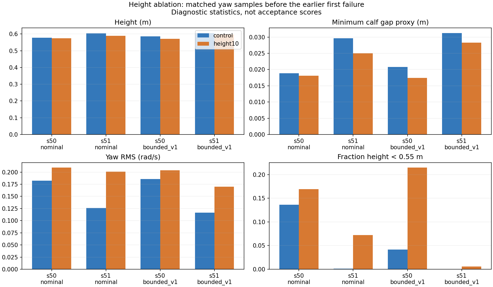

# Диагностика height 0/−10, 19 сентября 2026

> Исторический протокол завершённого опыта. Результаты и условия ниже сохранены;
> актуальные решения и очередь: [план](PROJECT_PLAN.md), [журнал](TRAINING_PROGRESS.md).

**Завершена.** Восемь новых replay завершились с exit0 и точно воспроизвели
исходные results/first_failures/cases; проверены hashes и физические свойства.
Четыре reference/seed49 traces повторно использованы после проверки целостности.
Контроли с другими export hashes пересчитаны заново, несмотря на одинаковые outcomes.
[Полный отчёт](results/2026-09-19-height-yaw-diagnosis.json).

## Результаты до первого отказа

Сравниваются одинаковые case/time после2s settling и строго до более раннего
первого отказа любой политики в паре. Эти числа — диагностические, не повторный
расчёт acceptance по укороченным эпизодам. Столбцы: control → height−10/L2.

| Seed/profile | Средняя высота, м | Средний минимальный зазор голеней, mm | Yaw RMS, рад/с |
|---|---:|---:|---:|
| seed50_nominal | 0.5769 → 0.5738 | 18.88 → 18.07 | 0.182 → 0.209 |
| seed51_nominal | 0.6033 → 0.5895 | 29.65 → 24.99 | 0.126 → 0.201 |
| seed50_bounded_v1 | 0.5852 → 0.5715 | 20.82 → 17.45 | 0.186 → 0.204 |
| seed51_bounded_v1 | 0.6059 → 0.5978 | 31.26 → 28.29 | 0.117 → 0.170 |

Во всех четырёх парах средняя высота и зазор уменьшились, yaw RMS вырос.
У seed50 positive-yaw RMS ещё до первого отказа составляет0,257 nominal и0,273
bounded при height−10; control0,130/0,137. Это диагностический срез, не новый gate.
Из14 control failures исправлены2 bounded cases; добавлены11 новых failures:
3 seed50 nominal,7 seed50 bounded и1 seed51 nominal. Итого14→23.

Не следует объяснять всё пробуксовкой или исключать насыщение приводов вообще.
В3 из37 собственных предконтактных окон найден leg clipping: все у height−10,
seed50 nominal case29 (2/99 samples), bounded case29 (12/99) иcase37 (38/100);
максимальная разность computed/applied torque ≈2,04/10,30/12,15 N·m.
В остальных34 окнах clipping не обнаружен. Это новое наблюдение на более широкой
матрице; оно не отменяет отсутствие clipping в прежних23 staged окнах.

## Награды и исторически выбранный фактор

За последние300 training updates weighted height L2 term −0,00998/−0,01071
reward/s для seeds50/51; pose penalty −0,35897/−0,33731. Это разные физические
величины и масштабы: сравнение их абсолютных значений не доказывает доминирования
или причинности. На парных replay-окнах форма восстановлена из manifest/config,
с upright multiplier иdt; тест сверяет формулы с pinned upstream.
Полный undesired_contacts по trace не восстанавливался: записаны только calves
и wheels, поэтому calf-only proxy явно отделён от фактических training logs.

По результатам был выбран development фактор: **односторонний линейный штраф просадки
ниже0,60м**, weight−10, вместо отсутствующего height term у control. Он не
штрафует высоту выше цели и даёт линейный сигнал ниже неё. Цель, weight и
остальные rewards сохраняются из зарегистрированных условий; форма не считается
успешной до оценки. Это не раздельный тест линейности и односторонности.
[Обоснование и бюджет](HEIGHT_FLOOR_ABLATION.md),
[решение до запуска](results/2026-09-19-height-next-decision.json).
Последующая проверка lower-L1 завершена без кандидата: 14→23 отказа;
новые решения ведутся в [плане](PROJECT_PLAN.md).

Seed49 сохраняет статус успешного локального Flat-кандидата и не дообучается.
Независимая приёмка и Rough остаются отдельными этапами.

## Исходный протокол до replay

Протокол зарегистрирован до replay по пересмотренному PROJECT_PLAN.
Цель — установить, как изменилась высота, поза голеней и yaw при height−10,
и выбрать один следующий фактор. Это диагностика раскрытых development cases.

## Матрица и целостность

Восемь новых replay: control/height10 × seeds50/51 × nominal20261201/bounded20261202.
Экспорты controls имеют другие SHA256, чем contact3x, поэтому совпадение outcomes
не используется для подмены traces. Reference и seed49: четыре существующие
staged traces, только после проверки policy/report/recorder/trace SHA256,
cases и physical digest. Seed49 не дообучается.

Исходный опыт: logs/ablations/flat_height_dev50_51_20260919/job.json.
Очередь: scripts/run_height_yaw_diagnostics.py.
Новые outputs: logs/diagnostics/height_yaw_diagnostics_20260919/ и
logs/qualification/height_yaw_diagnostics_20260919/; исходные файлы сохраняются.
Каждый replay: 100 сред, 2 s settling +20 s measurement, 4400 substeps по5ms;
trace содержит24 yaw cases. Reference/seed49 охвачены теми же cases.
Последовательный запуск на desktop, timeout600s/replay; error/mismatch/telemetry
блокирует очередь. До старта ≥50% VRAM свободно, перед переходом проверка ≥5%.
Восемь результатов и first_failures должны точно совпасть с исходными.

## Анализ

Сопоставленные интервалы: settling отдельно; measurement до первого отказа
любой политики в паре; собственные предконтактные окна0,5s с флагом уже
отказавшего comparator. Выделить общие, исправленные и новые failure cases.
Показать оба знака yaw, включая успешные cases, без post-failure bias.

Измерения: высота/error0,60m/time<0,55m, наклон, DAE mesh clearance всех голеней,
joint pose/velocity, computed/applied torque ног, action/targets, forces,
signed yaw bias и RMS. Mesh/implicit wheel torque остаются proxy.

Offline reward reconstruction использовать только по фактической формуле,
training manifest/config и доступным полям. Брать policy boundaries и явные
temporal masks. Не использовать --reward_diagnostics как готовые вклады
height/contact overrides. TensorBoard последних300 updates анализировать
отдельно от replay; общий reward не заменяет качество.

До получения этих результатов фактор следующей абляции не назначался. Новое обучение и
независимая приёмка не являются частью этой replay-очереди.
