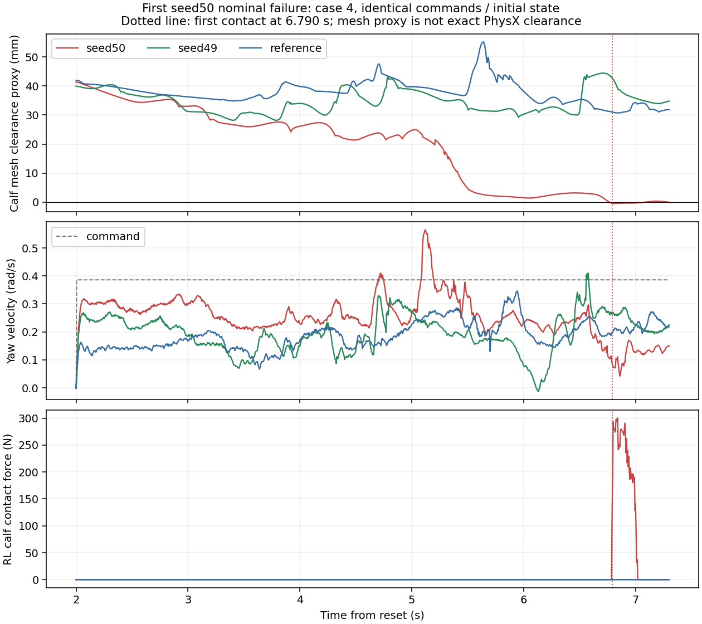

# Staged Flat: диагностика поворотов, 18 сентября 2026

<!-- locomotion-scope-2026-09-25 -->
> Исторический документ. С 25.09.2026 цель — низкоуровневая locomotion57→16 по
> внешним командам скорости. Cycle/corridor/landing-stop и навигационные условия
> ниже относятся к исходному протоколу; его результаты, статусы и текст сохранены.
> Прежние следующие шаги не являются текущим планом. Актуальная приемка и порядок
> работ: [PROJECT_PLAN.md](PROJECT_PLAN.md). Состояние новой приемки указано в действующем плане.
<!-- /locomotion-scope-2026-09-25 -->

> Исторический протокол завершённого опыта. Результаты и условия ниже сохранены;
> актуальные решения и очередь: [план](PROJECT_PLAN.md), [журнал](TRAINING_PROGRESS.md).

**Продолжение 19.09.2026:** [контактная абляция](CONTACT_WEIGHT_ABLATION.md) завершена
без кандидата. Повторная диагностика и [опыт высоты](HEIGHT_WEIGHT_ABLATION.md)
также завершены; height−10 кандидата не дал. [Парное сравнение control/height−10](HEIGHT_DIAGNOSIS.md) также выполнено;
последующий [lower-L1 опыт](HEIGHT_FLOOR_ABLATION.md) завершён без кандидата.
Ниже сохранено исходное обоснование опыта −1/−3.

**Диагностика выполнена.** Все восемь passive replay завершены с exit 0 и
точно воспроизвели исходные `results` и `first_failures`; cases, policy hashes
и physical digests совпали. Записаны все 4400 physics steps по 5 ms для 24 yaw
окружений каждой оценки. Обучение во время replay не выполнялось.
[Полный JSON](results/2026-09-18-staged-yaw-diagnosis.json).

## Что измерено

Сравнены 23 окна по 0,5 s непосредственно перед первым контактом seed50/51.
Для seed49 и reference взяты те же env/case и временные интервалы.
Падений в исходных первых отказах нет: 22 RL_calf при positive yaw и
один FL_calf при negative yaw.

| Измерение | Политика с отказом | Seed 49 | Reference |
|---|---:|---:|---:|
| Медиана зазора исходной mesh голени в сопоставленных окнах | 2,3 mm | 33,8 mm | 38,5 mm |
| Диапазон медиан зазора по окнам | −0,4…6,2 mm | 27,7…42,0 mm | 28,6…43,9 mm |
| Медиана среднего бокового движения нижней точки нагруженного колеса | 0,017 m/s | 0,101 m/s | 0,032 m/s |

В **0 из 23 предконтактных окон** у неуспешной политики зарегистрирован
clipping explicit приводов ног: computed и applied torque совпадают с допуском
1e−3 N·m. Это исключает непосредственное ограничение момента в данных окнах,
но не saturation в другое время и не все возможные проблемы actuator model.
Raw action clipping и live observation/action-target errors в исходных оценках — 0.

Различие в траектории голени устойчиво в сопоставленных окнах. Большой боковой
slip proxy не выделяет неуспешную политику: seed49 успешно проходит при большем
значении. По этим данным нельзя объявлять пробуксовку единственной причиной.
У seed50 в последних 300 updates также хуже command-error metrics и contact
penalty, чем у seed49; training metrics не равны evaluation RMS.

График показывает первый зарегистрированный отказ seed50, case4, t=6,790 s.
До контакта зазор голени уменьшается, затем фиксируется контактная сила;
у seed49/reference на той же команде зазор сохраняется. Это иллюстрация одного
случая; сводная таблица использует все 23 окна.

## Пределы геометрических измерений

Зазор вычислен трансформацией вершин исходной DAE collision mesh через фактические
link pose; поддержка convex hull сохраняет минимум исходных вершин. Это proxy,
а не точный зазор cooked collider PhysX: convex approximation и contact offsets
могут отличаться. Отрицательные доли миллиметра не доказывают дефект физики.

Slip proxy — скорость нижней точки mesh: `v_link + omega × r`, разложенная по
горизонтальной оси колеса и направлению качения, только при wheel contact >1 N.
Это не измеренная скорость solver contact point. Wheel actuator implicit:
его computed/applied torque — оценка PD; в вывод о clipping входят только ноги.

## Различие учёта контактов

Train undesired_contacts использует history length 3, policy decimation 4,
sensor update каждый physics step. Первый substep может отсутствовать в history
на момент reward. На записанных yaw calf traces последние три substeps пропустили
43 из 8635 окон env × policy-step × calf с контактом (включая после первого отказа).
Контакт целиком пропущен в одном из 23 отказавших эпизодов: seed50 nominal
negative yaw. Это диагностическая реконструкция на replay, а не прямое измерение
потерянной награды в training. Оставшиеся 22 эпизода всё равно обнаруживаются;
этот sampling gap не объясняет общий провал серии.

Штраф −1 в исследованной конфигурации считает контактирующие тела, эпизод не завершается;
evaluator хранит sticky failure после любого контакта >1 N на каждом substep.
Формы целей отличаются. History/termination/threshold не меняются одновременно
с весом: их влияние требует отдельного опыта при необходимости.

## Исторически выбранный эксперимент — завершён 19 сентября

Гипотеза: увеличить цену undesired contact, чтобы обученная поза при yaw
сохраняла зазор без провала tracking. Зарегистрирована [парная абляция −1/−3](CONTACT_WEIGHT_ABLATION.md)
на development seeds50/51 от одинаковых model_2499, по1500 updates на группу.
Итог: отказы сократились 23→14, но оба seed/profile gates seed50 не пройдены,
кандидата нет. Приёмка трёх новых seeds возможна только после успешного нового
development-опыта; её текущие условия описаны в пересмотренном плане.

## Воспроизведение и проверки

- Запись: `scripts/replay_reference_b2w.py --yaw_trace`, отдельные outputs;
  существующий report/NPZ не перезаписывается.
- Очередь: `scripts/run_staged_yaw_diagnostics.py`; исходные evaluations сохранены.
- Анализ: `scripts/analyze_staged_yaw.py`, `scripts/yaw_trace_analysis.py`.
- Локальные traces и exit/provenance: `logs/diagnostics/staged_yaw_diagnostics_20260918/`
  и `logs/qualification/staged_yaw_diagnostics_20260918/`.
- После изменений: 66 тестов прошли, vendor verify — 1290 файлов/6 источников.
  Изменения сделаны вне vendor; trainer получил отдельный opt-in weight override.
