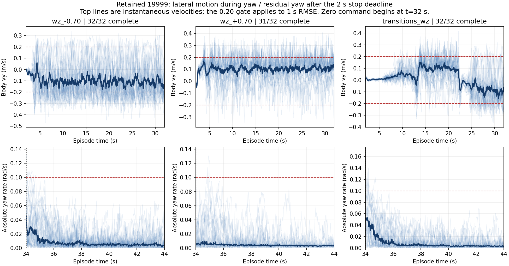

# 19999: разбор yaw и остановки по сохранённым трассам

25 сентября 2026. Выполнен offline-анализ единственной текущей
[проверки Isaac Flat](../../results/2026-09-25-operating57-19999.md).
Новых эпизодов, inference, обновлений policy и серверных jobs: **0**.
Это анализ той же проверки, не новая qualification.

Численные результаты: [analysis.json](analysis.json). Воспроизведение:

```powershell
& .\scripts\run_local.ps1 scripts/analyze_operating57_yaw_stop.py
```

Скрипт сначала проверяет hashes retained evidence и повторно оценивает все
1152 эпизодов; все метрики, segments и outcomes совпали с сохранённым JSON.
Raw JSON/NPZ, checkpoint, export, старый отчёт и его manifest не изменены.
Hashes нового анализатора отделены от source hashes выполненного screen.

## Установленные факты

### Побочная скорость при yaw сохраняется после начального перехода

Ниже — число полных ненулевых segments с нарушением moving RMSE по `vy`.
Знаменатель исключает незавершённый segment; unsafe остаются в полном denominator
32 эпизодов при принятии решения по строке. Время относительно начала команды.

| Команда yaw, rad/s | Нарушение vy за segment | Нарушение vy после 20 s | Медиана максимального moving RMSE(vy), m/s | Нарушение moving RMSE(wz) |
|---|---:|---:|---:|---:|
| −0.5 | 23/32 | 11/32 | 0.2042 | 0/32 |
| +0.5 | 0/32 | 0/32 | 0.1570 | 0/32 |
| −0.7 | 32/32 | 31/32 | 0.2436 | 0/32 |
| +0.7 | 12/31 | 5/31 | 0.1952 | 0/31 |
| −1.0 | 32/32 | 31/32 | 0.2649 | 0/32 |
| +1.0 | 29/30 | 20/30 | 0.2270 | 0/30 |

При ±0.3 есть отдельная проблема недостаточного yaw-отклика, описанная в исходном
отчёте. Её нельзя переносить на ±0.5/0.7/1.0: на этих командах moving yaw RMSE
в завершённых segments проходит. Прохождение RMSE само по себе не заменяет gate
по mean response. Отрицательные и положительные повороты различаются по `vy`;
из сохранённых данных нельзя установить физическую причину асимметрии.

### Удержание нуля: преимущественно короткие остаточные вращения

Из 1152 эпизодов 1149 дошли до полного нулевого segment. Из них 1079 прошли
непрерывный ноль, 70 не прошли; три unsafe не считаются успешной остановкой.

| Причина нарушения после 2 s | Эпизоды |
|---|---:|
| Только `abs(wz)>0.10 rad/s` | 66 |
| Только `norm(vxy)>0.10 m/s` | 3 |
| Оба ограничения | 1 |

69 из 70 отказов произошли после yaw, движения с yaw или последовательности yaw;
ещё один — после `vy=+1.0`. В 62 эпизодах после deadline уже был хотя бы один
хороший отсчёт, за которым следовало новое нарушение. Это не доказательство
предшествующей устойчивой остановки, но проверка только первого входа в допуск
скрыла бы эти отказы.

Среди 70 отказов медиана суммарного времени вне допуска после deadline — 0.10 s,
максимум — 0.50 s. Медиана времени последнего нарушения — 2.58 s от нулевой команды,
максимум — 6.38 s; четыре эпизода имеют нарушения после 4 s, ни один после 8 s.
Это не основание расширять settling: критерий остаётся 2 s + 10 s непрерывного нуля.

### Три выхода RR hip не объясняются насыщением его момента

Во всех трёх unsafe сработал `RR_hip_joint`:

| yaw | Seed | Время эпизода, s | Выход за hard range, rad | Пик момента RR hip за наблюдённую часть, Nm |
|---|---:|---:|---:|---:|
| +0.7 | 8228 | 11.310 | 0.001555 | 77.49 |
| +1.0 | 8205 | 3.455 | 0.001178 | 84.07 |
| +1.0 | 8211 | 3.440 | 0.001039 | 80.39 |

Сохранённая доля насыщения этого сустава — 0 во всех трёх эпизодах; номинальный
effort limit модели — 200 Nm, детектор насыщения — 95% этого значения.
Пиковые значения не являются значениями в момент выхода. В NPZ нет рядов joint
position, targets, actions, contacts и torques; определить направление выхода,
связь с target или причинность wheel saturation по нему нельзя.
До объяснения нарушений admission policy остаётся закрытым.

## Аудит контракта и обучения

- Screen измерял `root_lin_vel_b[:2]` и `root_ang_vel_b[2]`. Tracking rewards в
  pinned robot_lab используют те же body-frame скорости. Ошибки world/body в
  этих двух местах не обнаружено.
- В выполненном screen observation parity и command readback имели max abs 0.0.
  Previous action — raw action предыдущего policy step, wheel position observations
  обнулены, actor 57→16, policy dt 0.02 s. NPZ не содержит observations/actions,
  поэтому новый полный replay actor по этим трассам невозможен.
- Исходный [env.yaml](../../../policies/server/upstream_19999/env.yaml) задаёт
  heading command, `rel_heading_envs=1`, `rel_standing_envs=0.02`, resampling 10 s,
  horizon 20 s. Heading command превращает ошибку heading в меняющийся yaw-rate;
  это отличается от длительного фиксированного yaw-rate во внешнем контракте.
- На исходных terrain без pits линейный deadband обнуляет круг радиуса 0.2 внутри
  равномерного квадрата [-1,1]². Теоретическая вероятность нулевого линейного
  вектора до standing mask — π·0.2²/4 ≈3.14% resampling. Это расчёт по генератору,
  не измеренная частота чистых поворотов в завершённом обучении.
- `stand_still` штрафует отклонение leg positions от default pose при малой команде,
  а не непосредственно скорость корпуса. Ноль скорости поощряется общими tracking
  rewards. Wheel torque/power/velocity penalties в сохранённом конфиге выключены;
  leg torque/power penalties включены. Из этого нельзя заключить, что изменение
  коэффициентов устранит наблюдаемые отказы.
- Compiled nominal mass screen — 82.41985 kg. Аппаратная масса и limits этим
  не подтверждены; произвольное усиление торможения без контроля 12+4 приводов
  не обосновано текущей telemetry.

### Восстановление learning rate перед будущим resume

Checkpoint 19999 сохранён с Adam LR **0.00011390625149942935**;
`agent.yaml` содержит начальное значение 0.001. Проверено чтением checkpoint
через `torch.load(..., weights_only=True)` без inference/обучения.

В локальном RSL-RL `OnPolicyRunner.load()` загружает optimizer state, но не
синхронизирует `PPO.learning_rate`. Adaptive schedule затем записывает это
отдельное значение обратно в optimizer. Поэтому будущий launcher обязан после
load установить `alg.learning_rate` из optimizer param groups и проверить их
совпадение до первого update. Не менять vendor или глобальный пакет.
Серверная реализация ещё не сверена; это требование preflight, не утверждение
о том, как выполнялся завершённый серверный run.

Проверенная локальная версия — RSL-RL 3.1.2 из `D:/isaacsim51/Lib/site-packages`.
SHA-256 прочитанных исходников: `rsl_rl/runners/on_policy_runner.py` —
`6ffaee7e154a49ae55eebf53a7b1549f0461a1742d92dd34af5bb4b785d19cf2`,
`rsl_rl/algorithms/ppo.py` —
`4373ac1b2f9fdf14d9da57516968fc95d8f605d2967fee01dc61bf0d09423478`.

## Вывод для следующего эксперимента

Обосновано проверить **изменение распределения команд**: больше чистых поворотов,
прямые body-frame команды, более частые и достаточно длинные нулевые segments.
Причинная гипотеза пока не подтверждена. Первый эксперимент сохраняет rewards,
ABI и приводы, чтобы не смешивать эффект команд с настройкой физики/наград.

Подготовлен [протокол ограниченного эксперимента](../../experiments/19999_yaw_stop_v1.md).
Исследование RR hip требует дополнительной step telemetry в будущем запуске.



На графике показаны все завершённые эпизоды выбранных строк и медиана. Верхний
ряд — мгновенный `vy`; gate применяется к RMSE окна 1 s, а не к отдельным пикам.
Нижний ряд начинается после deadline остановки; нулевая команда подана на 32 s.
