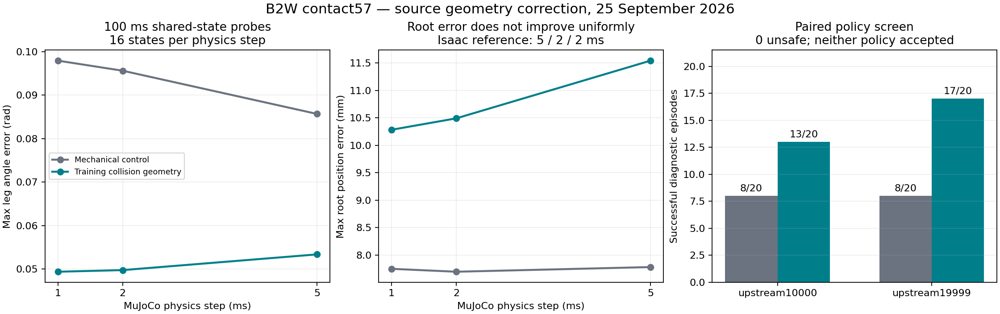

# Contact57: геометрия столкновений и парный policy screen

Дата: **25 сентября 2026**. Продолжение [physics57 diagnosis](2026-09-25-physics57-diagnostics.md).
Выполнено локально на RTX4080 Laptop/CPU MuJoCo. ABI57→16, 50 Hz, exports и
низкоуровневые acceptance gates сохранены. Нового обучения не было.

**Результат:** реализован opt-in профиль `source_shapes`, воспроизводящий исходную
геометрию столкновений training USD, joint frames и отключенные self-collisions.
В коротком парном screen success вырос с8/20 до13/20 у10000 и с8/20 до17/20 у19999.
Это причинное свидетельство влияния модели контактов, **не приемка policy**.
Ошибка углов ног уменьшилась, ошибка положения корпуса выросла; P2 остается открытым.

## Что изменено и проверено

Из живой nominal Isaac environment извлечены20 collision shapes, их вершины и
преобразования относительно17 rigid bodies. Сохранены исходные USD paths и hashes.
Извлечение учитывает instance proxies, дочерние Mesh под CollisionAPI на Xform,
повороты и неравномерный scale primitive boxes.

- Vendor MuJoCo имеет36 активных robot geoms: по два mesh на колесо и четыре box
  на голень. Новый профиль отключает их и создает20 форм training USD.
- Для восьми calf/wheel meshes используются выпуклые оболочки исходных вершин;
  исходные convexHull semantics сохранены. Примитивы Cube/Cylinder перенесены с
  собственными размерами и преобразованиями. Массы от новых geoms не добавляются.
- Movable joint origins/axes перенесены из training URDF, включая −1mm поY у
  правых wheel frames. Self-collisions отключены masks, контакт с terrain сохранен.
- Mechanical model и implicit wheel servo остаются такими же, как у прежнего
  `mechanics_implicit`; contact solver parameters MuJoCo не подбирались по score.

| Проверка | До | После |
|---|---:|---:|
| Активные robot collision shapes | 36 | 20 |
| Максимальное расхождение положения body, 17 bodies ×3 poses | 0.999mm | 0.000431mm |
| Максимальная ошибка ориентации body | 6.76e−7rad | 6.76e−7rad |
| Ошибка опорной функции новых форм относительно исходного USD | — | 1.38e−8m |

Геометрия проверена после компиляции MuJoCo по2054 направлениям на каждую форму.
Это проверка преобразования исходной геометрии, не PhysX cooked hulls.
В4096 диагностических направлениях расхождение внешних границ vendor и training
форм достигает43–49mm у колес и102mm у голеней. Эти значения относятся к локальным
опорным функциям геометрии; это не ошибка траектории и не расстояние между осями.

Профили заранее зафиксированы последовательно: `mechanics_control` → `frames` →
`frames_masks` → `source_shapes`. Физика выбрана по training asset, до policy outcomes.
Это диагностическая модель reference asset, не измеренная модель реального B2W и
не новый default существующих evaluators/viewers.

## Короткие контактные пробы

**192 новых пробы:** 16 одинаковых исходных состояний ×4 профиля ×3 physics dt.
Состояния stand/rolling/slope/step взяты из прежнего Isaac trace в1/3/5/7s.
После reset одинаковые physical targets удерживаются100ms. Использованы ранее
измеренные Isaac references при dt5/2ms; MuJoCo проверен при5/2/1ms.
Три предыдущих mechanical control воспроизведены на48 состояниях с максимальным
численным расхождением3.06e−13 по dq; это roundoff применения rotation matrix.

Результаты при dt2ms в обоих движках, максимум/медиана по16 состояниям:

| Профиль MuJoCo | Max leg q error, rad | Median leg q error, rad | Max root position error, mm |
|---|---:|---:|---:|
| Mechanical control | 0.095607 | 0.055047 | 7.698 |
| + joint frames | 0.095707 | 0.055073 | 7.716 |
| + collision masks | 0.095707 | 0.055073 | 7.716 |
| + source shapes | **0.049752** | **0.020053** | **10.490** |

В этом наборе masks сами по себе не изменили результат. Перенос форм уменьшил
ошибку ног, но не все ошибки динамики. При уменьшении MuJoCo dt2→1ms максимальное
изменение углов ног снизилось с0.017843rad у control до0.004799rad у source_shapes;
это проверка чувствительности к timestep, не доказательство полной сходимости.
Собственная Isaac чувствительность5→2ms ранее составила0.025049rad в этих probes.



## Парный low-level policy screen

**40 новых эпизодов** сопоставлены с40 ранее выполненными mechanical controls.
Два checkpoint, пять прежних сценариев, seeds7201…7204, dt2ms, policy50Hz.
Совпадают export SHA, command schedules, horizons, reset seeds и gates
`locomotion57_v1`. Новых Isaac policy rollouts в этом этапе нет.

| Сценарий | 10000 control → source shapes | 19999 control → source shapes |
|---|---:|---:|
| Flat vx=0.5m/s | 0/4 → **4/4** | 1/4 → **4/4** |
| Flat vx=1.0m/s | 4/4 → **4/4** | 3/4 → **4/4** |
| Up14×32, vx=0.3m/s | 0/4 → **0/4** | 0/4 → **1/4** |
| Up14×32, vx=0.7m/s | 2/4 → **3/4** | 4/4 → **4/4** |
| Up14×32, interrupted external command | 2/4 → **2/4** | 0/4 → **4/4** |
| Всего success | 8/20 → **13/20** | 8/20 → **17/20** |
| Unsafe | 0 → **0** | 0 → **0** |

У10000 осталось3 primary tracking failures,1 command-transition failure и3
standstill failures. У19999 —3 primary tracking failures; есть также1 zero-command
failure flag в эпизоде с другим primary outcome. В частности, малую продольную
команду на лестнице нельзя считать решенной. Четыре seeds в строке не дают
статистической qualification. 15000 в этот причинный micro-screen не входил;
его прежний low-level статус сохраняется.

## Ограничения и следующий шаг

1. **PhysX cooked hulls еще не получены.** Public cooking readback для CollisionAPI
   на Xform вернул `RESULT_ERROR_COOKING_FAILED`, для дочернего Mesh instance proxy —
   `RESULT_ERROR_INVALID_PARSING`. Это сохраненные неудачные readback attempts,
   не успешная выгрузка runtime hulls. Перенесены source convex hulls:453–838
   вершин на mesh. Упрощение PhysX при cooking пока не измерено.
2. **Контактные решатели не эквивалентны.** Nominal Isaac material имеет restitution1,
   а параметры MuJoCo solref/solimp описывают другую контактную динамику. Простое
   присваивание одинаковых чисел не делает их эквивалентными.
   [MuJoCo: solver/contact parameters](https://mujoco.readthedocs.io/en/stable/modeling.html#solver-parameters).
   Ни restitution1, ни используемые friction не объявлены измерениями B2W.
3. Сначала получить воспроизводимую cooked-geometry inspection на отдельной копии
   asset, проверить contact/rest offsets, затем выполнить отдельный drop/rolling
   impact protocol и объявленный restitution/contact sensitivity envelope.
   Не выбирать настройки по максимальному policy success.
4. **Slip telemetry требует новой версии измерения.** Замороженный evaluator
   использует radius0.0875m и `wheel_speed*radius − base_vx`. Source wheel mesh
   занимает около0.226m поX/Z. Этот старый slip proxy не является измеренным
   скольжением в контакте; он не участвует в данном behavioral pass/fail.
   Для нового прибора нужны фактическая контактная точка и ее касательная скорость.
5. После этой диагностики расширить baseline и определить bounded low-level pilot.
   Переход к новому train не требует предварительного pass старой policy, но требует
   документированной физики и измеренного failure. Серверные jobs и hardware не запускались.

**Последующее указание пользователя:** больше не тратить время на upstream10000.
Его уже завершенные13/20 сохранены в отчете; новых запусков этого checkpoint не будет.
Дальнейшие upstream diagnostics выполняются с19999. Это ограничение заменяет
прежний план постоянно использовать10000 как парный контроль.

## Воспроизводимость и проверки

- [Замороженный протокол](../../configs/contact57_diagnostics_20260925.json),
  [геометрия и compiled reference](../../configs/contact57_geometry_20260925.json).
- [Сводные результаты, строки и hashes](evidence/contact57_20260925/summary.json).
- Raw results: `logs/contact57_20260925/`; logs/cache не добавляются в Git.
- [Opt-in adapter](../../scripts/contact57_model.py),
  [paired probes](../../scripts/probe_contact57.py),
  [policy screen](../../scripts/eval_contact57_micro.py).
- 285 unit tests — OK;1290 vendor-файлов из6 источников — неизменны.
  Прежние5184 эпизода и physics57 evidence сохранены со своими hashes.

Ниже — команды **уже выполненного этапа**, а не очередь новых запусков.
Замороженный micro runner включает10000 и больше не запускается по последующему
указанию пользователя. Для дальнейших experiments нужен отдельный protocol/namespace
с19999. Существующие результаты защищены от перезаписи.

```powershell
& ./scripts/run_local.ps1 scripts/export_contact57_geometry.py
& ./scripts/run_local.ps1 scripts/prepare_contact57.py
& ./scripts/run_local.ps1 scripts/probe_contact57.py static
& ./scripts/run_local.ps1 scripts/probe_contact57.py states
& ./scripts/run_local.ps1 scripts/eval_contact57_micro.py
& ./scripts/run_local.ps1 scripts/summarize_contact57.py
```
