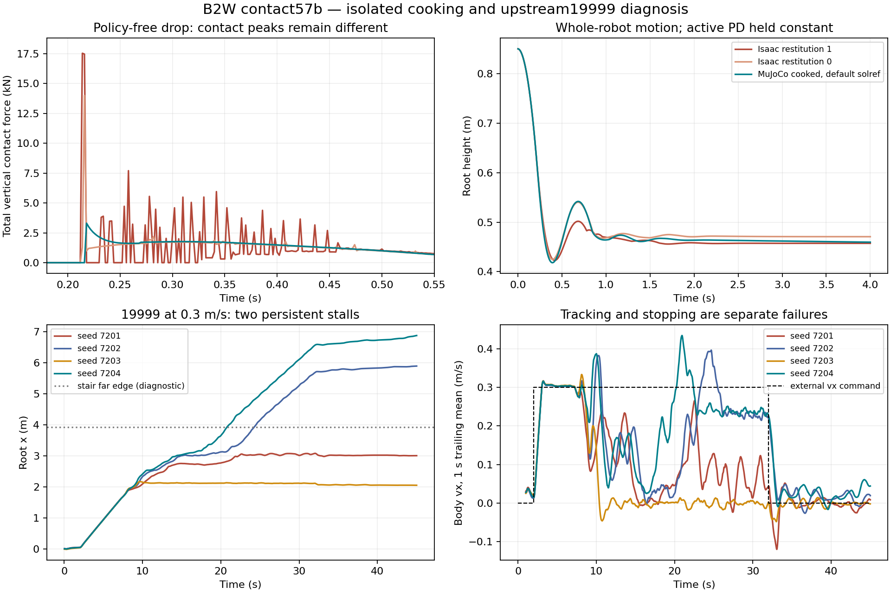

# Contact57b: обработка геометрии PhysX и отказы upstream19999

Дата: **25 сентября 2026**. Продолжение [Contact57](2026-09-25-contact57-diagnostics.md).
В этом этапе использован только upstream19999. Новых запусков upstream10000,
обучения, server jobs и hardware actuation не было. ABI57→16 и policy50Hz сохранены.

**Вывод:** обработка collision meshes существенно меняет контактную геометрию,
а качество19999 чувствительно к этому изменению. С обработанными оболочками
success снизился17/20→12/20, unsafe0. Отказ при0.3m/s разделен на два застревания,
один command-transition failure и один standstill failure. Политика не принята.

## Полученная геометрия и параметры runtime

Предыдущий public cooking readback не принимал CollisionAPI на Xform и дочерний
Mesh instance proxy. В новом inspector создана отдельная неинстансированная копия
каждого mesh: исходные точки в body frame, topology, authored PhysX settings и
`convexHull`. Все восемь запросов вернули `RESULT_VALID`.

Это **результат cooking отдельной копии с исходными настройками**, не прямое чтение
буфера shape из работающей GPU articulation. Исходный asset/vendor не изменен.
Ограничение provenance сохранено в JSON; идентичность live GPU hull buffers не заявлена.

| Shape | Исходная convex hull | PhysX cooked hull | Максимальное уменьшение опорной функции |
|---|---:|---:|---:|
| Left calf | 458 vertices | 42 | 1.782mm |
| Right calf | 453 vertices | 42 | 2.015mm |
| Left wheel | 838 vertices | 34 | 8.678mm |
| Right wheel | 799 vertices | 34 | 6.960mm |

Числа одинаковы для передней/задней пары соответствующей стороны. Измерено4102
направления; объем wheel hull уменьшается примерно на9.2–9.6%. В исходных meshes
не обнаружено authored overrides PhysX cooking. Fallback `hullVertexLimit=64`,
`minThickness=0.001m`. Новый opt-in `cooked_shapes` содержит20 collision shapes;
скомпилированные MuJoCo формы проверены против экспортированных cooked vertices.
Mass/COM/inertia и actuator model остаются прежними.
Назначение cooking-параметров также описано в
[официальной PhysX schema](https://docs.omniverse.nvidia.com/kit/docs/omni_physics/107.2/dev_guide/schemas/physxschema.html);
численные результаты выше получены из установленного runtime, не из документации.

**Фактический readback из Isaac articulation:**20 contact offsets находятся в
диапазоне **0.000500–0.003040m**, все rest offsets **0**. Для wheel shapes offsets
около0.000999m. Это runtime readback через `get_contact_offsets/get_rest_offsets`,
а не USD fallback `−inf`. MuJoCo margin не приравнивался автоматически к PhysX
contactOffset: одинаковое число не обеспечивает одинаковое поведение решателя.

## Пробы без policy

Выполнено **36 четырехсекундных проб**, без actor inference: drop с root height0.85m
и rolling/braking с0.65m. Ноги удерживают одинаковые default targets; колеса во втором
сценарии получают4rad/s на интервале1…2.5s, затем0. Это whole-robot probes с активным
PD, не измерение коэффициента восстановления изолированного пассивного тела.

- Isaac: два сценария × dt5/2ms × robot restitution1/0.5/0 =12 probes.
  Terrain restitution1 и multiply combine сохранены; effective material записан.
- MuJoCo: два сценария × dt5/2ms × source/cooked shapes × solref damping ratio
  0.5/1/2 при time constant0.02s =24 probes. Остальная механика одинакова.
- Restitution и solref damping ratio не объявлены эквивалентными параметрами.
  Значения зафиксированы до результатов; выбор решателя по policy score не выполнялся.

Пример drop при dt2ms:

| Профиль | Первый контакт | Peak суммарной вертикальной силы | Вертикальный импульс за4s | Final root z |
|---|---:|---:|---:|---:|
| Isaac, restitution1 | 0.214s | 17.905kN | 3253.1N·s | 0.4573m |
| Isaac, restitution0 | 0.214s | 13.996kN | 3234.2N·s | 0.4707m |
| MuJoCo cooked, default solref | 0.218s | 3.303kN | 3233.6N·s | 0.4596m |

Близкий интегральный импульс и конечная высота не означают совпадения пиков контакта.
Это simulator force telemetry, не измеренные нагрузки реального робота. При nominal
Isaac restitution1 root-position RMSE за4s для MuJoCo cooked составляет68.7mm в drop
и42.1mm в rolling/braking. Для source geometry —41.6/46.2mm соответственно.
Переход к cooked geometry не улучшает все динамические метрики одновременно.

## Повторный screen19999

**20 новых эпизодов** с cooked shapes; control —20 прежних эпизодов19999 с source
shapes. Один и тот же export SHA, protocol/gates, seeds7201…7204, horizons и dt2ms.
Новых Isaac policy rollouts в этом этапе нет. Geometry treatment не меняет policy,
commands, actuator gains или MuJoCo solref defaults.

| Сценарий | Source shapes, ранее | Cooked shapes, новый |
|---|---:|---:|
| Flat vx0.5 | 4/4 | 4/4 |
| Flat vx1.0 | 4/4 | 4/4 |
| Up14×32, vx0.3 | 1/4 | 0/4 |
| Up14×32, vx0.7 | 4/4 | 3/4 |
| Up14×32, interrupted external command | 4/4 | 1/4 |
| Всего success | 17/20 | **12/20** |
| Unsafe | 0 | **0** |

Primary outcomes нового screen:12 success,2 tracking failures,1 command-transition
failure,5 standstill failures. Малый набор не является qualification; физику нельзя
выбирать по более высокому17/20. Source/cooked profiles остаются раздельными
диагностическими условиями, не заменяют default старых evaluators.

## Локализация медленного подъема

Внешняя команда0.3m/s подается от2 до32s. На последних пяти секундах этого интервала:

| Seed | Наблюдение | Итог |
|---|---|---|
| 7201 | Root x≈3.078m; продвижение за5s только30mm; FR wheel saturation27.2% policy samples | Застревание, tracking/transition failures |
| 7203 | Root x≈2.114m; продвижение за5s только1.7mm; FL wheel saturation60% policy samples | Застревание, tracking/transition failures |
| 7202 | Лестница пройдена, root x≈5.681m | Нарушен command-transition gate |
| 7204 | Лестница пройдена, root x≈6.563m | Нарушено удержание непрерывного нуля |

У7203 задние wheel centers остаются перед первым подступенком x2m, передние уже
находятся на лестнице. Средние targets FR/FL в последние5s ≈19.3/24.0rad/s,
фактические скорости ≈11.1/3.0rad/s. Значит policy не просто выдает слишком малую
wheel-команду. У7201 также сохраняются высокие wheel targets и значительная ошибка
следования joint position targets. Это свидетельство проблемы координации под
контактной нагрузкой; оно не доказывает, что увеличение gains/torque limits решит ее.

Root x, позы колес и изменение yaw здесь служат диагностикой физического состояния.
Corridor, абсолютный heading, возвращение в позицию и навигационная коррекция не
добавлены в acceptance. Приведенные saturation fractions измерены на policy samples
для локализации; отдельная safety telemetry продолжает работать на physics steps.
Скольжение в точке контакта этим этапом не измерено.

## Решение и дальнейшая очередь

1. Сохранить source/cooked geometry как объявленные варианты неопределенности.
   Не откатывать обработку ради score17/20 и не выбирать solref по policy success.
   Измерения настоящего B2W по-прежнему нужны для hardware fidelity.
2. Перейти к **19999 failure-state replay**: повторно захватить полное состояние
   двух stalls и двух controls, затем одинаково сбросить Isaac/MuJoCo и проверить
   восстановление tracking при прежней внешней команде. Нужны root pose + все6
   base velocities, q/dq и previous action. Нынешних диагностических traces с
   root pose и planar velocity недостаточно для точного full-state replay.
3. В этих состояниях записать reward components, applied torques и контактные
   скорости/силы. Проверить конкуренцию leg posture/energy penalties с progress;
   только после этого выбрать один causal PPO treatment. Новых navigation rewards
   и изменения57-input ABI не вводить. Увеличение силы колес сейчас не обосновано.
4. P2 остается частично выполненным, но не превращается в требование побитового
   совпадения длинных trajectories. Есть документированные profiles и измеренный
   failure; дальнейшие blanket gain/solver sweeps не являются следующим шагом.

[Зафиксированный следующий replay plan](../../configs/locomotion57_19999_replay_plan_20260925.json)
имеет статус `planned_not_executed`; его4 captures/12 replays не включены в выполненные
числа этого отчета.

## Evidence и воспроизводимость

- [Протокол и бюджет](../../configs/contact57b_diagnostics_20260925.json).
- [Cooked geometry](../../configs/contact57b_cooked_geometry_20260925.json).
- [Сводка, строки, диагностика и hashes22 raw JSON](evidence/contact57b_20260925/summary.json).
- [Inspector](../../scripts/inspect_contact57_cooking.py),
  [adapter](../../scripts/contact57b_model.py),
  [policy-free probes](../../scripts/probe_contact57b_impacts.py),
  [19999-only evaluator](../../scripts/eval_contact57b_19999.py).
- Logs/traces/isolated USD остаются в `logs/contact57b_20260925/` вне Git.
- **287 unit tests — OK;1290 vendor-файлов — неизменны.** Старые frozen protocols,
  exports и датированное evidence не переписаны. Новый evaluator отклоняет номер
  policy, отличный от19999, до загрузки runtime/weights.
