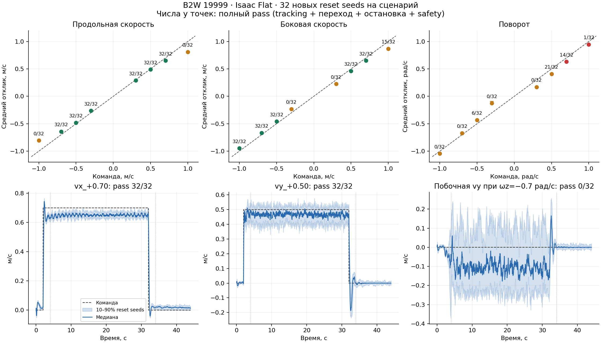

# Operating57: проверка19999 в диапазонах вендорского обучения

Дата:25 сентября2026. Запрос пользователя — проверить исходную модель с учетом
реального распределения команд стандартного vendor train.py; точность малых команд не является приоритетом.

**Выполнено1152 новых эпизода Isaac Flat:36 сценариев ×32 reset seeds8201–8232.**
716/1152 выполнили все применимые gates;3 unsafe по compiled hard joint ranges.
Проверялся frozen actor; обучение и аппаратные испытания не выполнялись.

## Что проверено

Parent19999 SHA-256: `e2ff3b7b5543e008e30bd3981b0d639a650eb187ef1412d399ac6c26a9557dcc`.
Тот же проверенный TorchScript export, ABI57→16,50Hz, deterministic actor.
Заморожены ±0.3/0.5/0.7/1.0 по каждой оси; четыре диагонали (±0.5,±0.5,0),
четыре сочетания (±0.5,0,±0.5), ноль и три последовательности .3→.7→−.5
с изменением команды каждые10s. Каждая последовательность заканчивается непрерывным нулем12s.
Обычный сценарий:2s initialization +30s постоянная команда +12s ноль.
Критерии этого screen: Flat RMSE≤(.2,.2,.25),
mean response≥80%, moving1s windows после2s settling, zero≤.1m/s и .1rad/s непрерывно10s.
Safety проверяется на каждом physics step200Hz, без startup grace и autoreset.
Observation parity и command readback: max abs0.0. Время simulation loop101.875s.

Saved training config: vx/vy±1m/s, yaw±1rad/s, linear vector norm≤.2 обнуляется,
resampling10s, standing probability2%, heading controller0.5, rel_heading_envs1.0.
Command curriculum выключен. Диапазоны совпадают с vendor defaults.
Этот screen проверяет поддерживаемые диапазоны, а не воспроизводит весь training distribution:
навигационной heading-коррекции нет, команды подаются напрямую; nominal physics и upright reset,
без training DR/observation noise;30s constant segments длиннее training resampling10s.

## Все новые строки

Полный pass включает старт/переход, установившийся tracking, остановку и safety.
Колонка steady отдельно показывает установившийся tracking в завершенных эпизодах;
она не заменяет полный pass. Средние скорости — медианы по полным ненулевым segments;
unsafe/incomplete всегда остаются в denominator полного pass.

| Сценарий | Full pass/32 | Steady/32 | Zero/32 | Unsafe | Медиана фактической скорости (vx,vy,wz) |
|---|---:|---:|---:|---:|---|
|stand|32|—|32|0|—|
|vx_-0.30|32|32|32|0|-0.262, 0.000, 0.003|
|vx_+0.30|32|32|32|0|0.289, 0.001, 0.001|
|vx_-0.50|32|32|32|0|-0.480, 0.001, 0.026|
|vx_+0.50|32|32|32|0|0.489, -0.000, -0.001|
|vx_-0.70|32|32|32|0|-0.641, 0.002, 0.050|
|vx_+0.70|32|32|32|0|0.651, -0.001, -0.001|
|vx_-1.00|0|15|32|0|-0.805, 0.002, 0.056|
|vx_+1.00|0|32|32|0|0.809, -0.003, 0.006|
|vy_-0.30|0|0|32|0|-0.005, -0.232, -0.006|
|vy_+0.30|0|0|32|0|0.015, 0.225, -0.009|
|vy_-0.50|32|32|32|0|-0.013, -0.458, -0.008|
|vy_+0.50|32|32|32|0|-0.010, 0.462, -0.017|
|vy_-0.70|32|32|32|0|0.006, -0.666, -0.013|
|vy_+0.70|32|32|32|0|-0.018, 0.651, -0.014|
|vy_-1.00|32|32|32|0|0.041, -0.946, -0.031|
|vy_+1.00|15|32|31|0|-0.019, 0.868, -0.016|
|wz_-0.30|0|0|23|0|0.050, -0.017, -0.125|
|wz_+0.30|0|0|25|0|0.017, 0.044, 0.170|
|wz_-0.50|6|32|25|0|0.057, -0.063, -0.432|
|wz_+0.50|21|28|23|0|0.018, 0.069, 0.410|
|wz_-0.70|0|32|28|0|0.052, -0.087, -0.671|
|wz_+0.70|14|31|27|1|0.022, 0.092, 0.630|
|wz_-1.00|0|32|28|0|0.050, -0.120, -1.045|
|wz_+1.00|1|30|27|2|0.038, 0.098, 0.946|
|diagonal_-1_-1|32|32|32|0|-0.475, -0.437, 0.007|
|turning_-1_-1|27|32|28|0|-0.462, -0.064, -0.472|
|diagonal_-1_+1|31|32|32|0|-0.452, 0.432, -0.017|
|turning_-1_+1|28|32|29|0|-0.450, 0.055, 0.461|
|diagonal_+1_-1|31|32|32|0|0.432, -0.412, -0.026|
|turning_+1_-1|30|32|30|0|0.481, 0.040, -0.480|
|diagonal_+1_+1|32|32|32|0|0.452, 0.448, 0.003|
|turning_+1_+1|29|32|29|0|0.474, 0.031, 0.448|
|transitions_vx|32|32|32|0|0.291, 0.001, 0.003|
|transitions_vy|3|3|32|0|-0.011, 0.227, -0.009|
|transitions_wz|0|0|22|0|0.023, 0.033, 0.134|

Для transitions медиана объединяет разные ненулевые segments; для анализа отдельных
переходов использовать raw JSON/NPZ. Точки32/32 являются development observations,
не статистическим доказательством99% надежности и не непрерывным рабочим envelope.

## Выводы по рабочим скоростям

- Все шесть продольных точек ±0.3/0.5/0.7 и longitudinal transitions прошли32/32.
- Боковые ±0.5/0.7 прошли32/32. При ±0.3 отклик есть (~0.225–0.232),
  но он составляет75–77% вместо необходимых80%, поэтому0/32.
- При vx±1.0 фактическая скорость ~±0.805–0.809; полный pass0/32 главным образом из-за moving-window error.
- Повороты ±0.7/1.0 дают большой установившийся отклик, но переходы/непрерывный ноль остаются проблемой.
  Для wz−0.7 steady32/32 при full0/32: это не отсутствие способности поворачивать.
  Причина всех32 transition flags в этой строке — незаданная боковая скорость: moving1s RMSE(vy)
  превышает0.20m/s; медиана максимума0.244m/s. По ωz moving-window нарушений здесь0/32.
  Нарушения встречаются и поздно в30s сегменте, поэтому это не только задержка начала поворота.
- Все диагонали имеют steady32/32; full31–32/32. Движение с поворотом: steady32/32, full27–30/32,
  преимущественно отказы остановки. Результаты отдельных осей не означают pass любых сочетаний.

## Три unsafe эпизода

Во всех случаях задний правый hip (`RR_hip_joint`) пересек compiled hard range с tolerance0.001rad:

| Команда | Reset seed | Время от начала,s | Выход за hard range,rad |
|---|---:|---:|---:|
|wz_+0.70|8228|11.310|0.001555|
|wz_+1.00|8205|3.455|0.001178|
|wz_+1.00|8211|3.440|0.001039|

Это небольшие превышения границ симуляционной модели; падения и base/hip-contact failures не зарегистрированы.
Они остаются unsafe по заранее зафиксированному протоколу. Аппаратные пределы не измерены.
Wheel speed peak38.55rad/s, maximum per-episode wheel saturation fraction7.18%,
longest saturation0.20s. Это telemetry, не отдельное допускающее решение для реальных приводов.

## Решение и evidence

19999 полезно исследовать в продольных точках0.3/0.5/0.7 и боковых0.5/0.7; полный заявленный диапазон
и combinations пока не проходят. Следующая приоритетная проблема — побочные линейные движения при
повороте и остановка после него
на рабочих командах. Этот screen не выполняет обучения и не даёт допуска к роботу.

- [Протокол и hashes исходного запуска](../../configs/locomotion57_19999_operating_screen_20260925.json).
- [Численная сводка, все строки и происхождение](evidence/operating57_19999_20260925/summary.json).
- [Все 1152 эпизода последней проверки](evidence/operating57_19999_20260925/episodes.csv).
- [Manifest и hashes](evidence/operating57_19999_20260925/manifest.json).
- Raw data: [результаты JSON](evidence/operating57_19999_20260925/isaac_flat.json), [трассы NPZ](evidence/operating57_19999_20260925/isaac_flat.npz).
