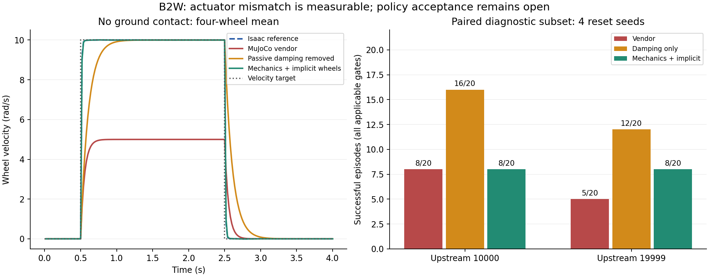

# Physics57: локализация расхождений Isaac и MuJoCo

Дата: **25 сентября 2026**. Выполнено после [проверки upstream10000/15000/19999](2026-09-25-upstream-locomotion57.md).
Scope: локальные probes и парное сравнение upstream10000/19999, без PPO, серверных
jobs и роботного I/O. ABI57→16, исходные exports и acceptance gates сохранены.

**Вывод:** найдено и причинно проверено лишнее пассивное демпфирование MuJoCo.
Отдельный adapter умеет устранять его и согласовывать compiled mass/COM/inertia,
armature, calf effort и wheel servo. P2 остается частично выполненным: геометрия
контактов и их динамика расходятся. Нового принятого checkpoint нет.

## Измеренные результаты

При внешней цели колёс **10 rad/s** без контакта с землёй:

| Модель | Установившаяся скорость колёс | Максимальная ошибка углов ног относительно Isaac, dt=0.002 s |
|---|---:|---:|
| Isaac reference | 9.9999 rad/s | — |
| MuJoCo vendor | 5.0000 rad/s | 0.031635 rad |
| Только passive damping→0 | 10.0000 rad/s | 0.035986 rad |
| Только armature→0 | 5.0000 rad/s | 0.038294 rad |
| Только compiled inertials | 5.0000 rad/s | 0.012195 rad |
| Только calf effort 320 Nm | 5.0000 rad/s | 0.031635 rad |
| Согласованные mechanical parameters | 9.9999 rad/s | 0.000570 rad |
| То же + implicit wheel servos | 9.9999 rad/s | 0.000570 rad |

У wheel PD gain `kd=1`; в vendor MJCF дополнительно действует passive damping `1`.
В стационарном свободном вращении баланс `1*(10-v) - 1*v = 0` дает `v=5`.
Однофакторное изменение damping подтверждает эту причину. Замена массы сама по себе
не устраняет ошибку установившейся скорости. Это подтверждение расхождения с
training model, а не измерение потерь реального привода.

Compiled Isaac: armature=0 на всех16 joints; passive static/dynamic/viscous friction=0;
solver damping ног=0 (DCMotor PD считается явно), wheel damping=1 — активный servo.
Он сохранен при удалении пассивной потери MuJoCo.



## Парный policy screen

120 эпизодов: два checkpoint × три варианта физики × пять сценариев × четыре
общих reset seeds7201…7204. Flat: vx=0.5/1.0; up14×32: vx=0.3/0.7 и
остановка/повторный старт по времени. Horizons и gates исходного `locomotion57_v1`
не менялись. Отсутствуют навигационный controller и коррекция actions по результату.

| Checkpoint | Физика | Success | Unsafe |
|---|---|---:|---:|
| 10000 | Vendor | 8/20 | 1 |
| 10000 | Только passive damping→0 | **16/20** | **0** |
| 10000 | Mechanics + implicit wheels | 8/20 | 0 |
| 19999 | Vendor | 5/20 | 2 |
| 19999 | Только passive damping→0 | **12/20** | **0** |
| 19999 | Mechanics + implicit wheels | 8/20 | 0 |

У 10000 при удалении пассивного damping сценарии vx=1.0 и stair interrupted
достигли4/4. Остались отказы в других строках. В combined mechanical варианте
часты отказы удержания нуля: 10/20 эпизодов у10000 и9/20 у19999 имеют этот flag.
В таблице primary outcome используется прежний приоритет; все flags сохранены.

Нельзя выбирать физическую модель по максимальному success. `damping_only` исправляет
одну подтвержденную несовместимость, но оставляет другие inertials/collisions.
`mechanics_implicit` гораздо точнее в бесконтактном probe, однако контактный режим
и policy на этой модели не квалифицированы. Исходный screen5184 не пересчитывается
задним числом, результаты разных физических профилей хранятся отдельно.

## Скомпилированные модели и контакт

- Сопоставлены17 rigid bodies. Mass: Isaac82.419853 kg, MuJoCo87.170292 kg.
  В adapter масса/COM/full inertia копируются из runtime Isaac, а не из названий
  исходных файлов. Тензор переводится в principal axes с проверкой положительности;
  восстановление полного тензора проверено тестом.
- Проверены три общие позы. Ориентации совпали до порядка7e−7 rad. У правых колёс
  позиционное расхождение около0.999 mm: URDF `FR_foot_joint`/`RR_foot_joint`
  задает origin y=−0.001 m, MJCF —0. Остальные расхождения порядка микрометров.
  Объявленный position tolerance1e−5 m здесь **не пройден**. Этот offset пока не исправлен.
- В runtime Isaac20 collision shapes; в vendor MuJoCo36 robot collision geoms
  (37 с поверхностью probe). У каждого колеса MuJoCo две активные mesh-геометрии:
  первая без `class="visual"` наследует contact flags, вторая имеет class collision
  и дополнительное смещение. Они физически активны, это проверено в compiled model.
- Calf collisions различаются: Isaac использует импортированную mesh-геометрию,
  MJCF — набор boxes. Self-collision в Isaac отключен; MJCF не содержит эквивалентного
  запрета всех пар звеньев внутри робота.
- Nominal Isaac material readback: static/dynamic friction/restitution=(1,1,1);
  terrain также задает(1,1,1) и multiply combine. В этом probe события DR отключены.
  MuJoCo имеет другой contact model, включая solref/solimp. Число friction0.4
  отдельного wheel geom не является само по себе эффективным pair coefficient.

Это конкретные незакрытые различия. Причинный вклад каждой collision shape,
self-collision и restitution еще не отделен отдельными изменениями.

## Короткие парные contact probes

Длинный open-loop replay одинаковых targets расходится быстро; некоторые MuJoCo
траектории покидают физическую полосу шириной2m. Их последующий свободный полет
не используется как доказательство ошибки контактного solver или как policy gate.
В evidence записано время выхода из полосы.

Поэтому выполнена дополнительная заранее зафиксированная серия: **16 общих
состояний** из stand/roll-brake/slope/single-step в моменты1/3/5/7s. Оба движка
сбрасываются в одинаковые root pose, joint q/dq и скорости; root COM velocity
Isaac переведена в velocity of root origin MuJoCo. На следующие100ms подается
одинаковый постоянный физический target. Длинная накопленная ошибка исключена.

| Вариант MuJoCo, dt=0.002 s | Максимальное расхождение leg q через100ms |
|---|---:|
| Vendor | 0.078179 rad |
| Damping only | 0.075159 rad |
| Mechanics + implicit wheels | 0.095607 rad |

Проверены dt0.005/0.002/0.001 s в MuJoCo и0.005/0.002 s в Isaac.
Собственная чувствительность Isaac к dt: max leg q delta0.001889 rad без контакта
и0.025049 rad в этих contact probes. Следовательно, контактные расхождения
нельзя автоматически приписать только политике или только inertia model.
Результаты отдельных состояний и dt сохранены; универсального contact pass здесь нет.

Wheel velocity servo реализован через gain/bias с отдельным force clamp±20Nm;
velocity command не ошибочно ограничивается torque ctrlrange. Для этого профиля
выбран implicitfast. Семантика сверена с [официальной документацией MuJoCo](https://mujoco.readthedocs.io/en/latest/computation/),
а force saturation проверена в действующем MuJoCo3.14.0.

## Решение и следующий этап

1. Использовать новый adapter как **явно выбираемый диагностический профиль**.
   Старые evaluators, vendor, веса и runtime viewer не менялись.
2. Перед следующим policy baseline построить collision profile из training geometry:
   убрать двусмысленность двойных wheel contacts, согласовать frames правых колёс,
   сравнить calf shapes и self-collision masks. Проверять геометрию и короткие
   одинаковые impacts, не выбирать параметры по success.
3. Зафиксировать обоснованный nominal contact envelope и dt convergence.
   Nominal restitution1 из исходной конфигурации не объявляется измерением B2W.
4. После этого повторить общий low-level baseline и дополнить его reference,
   inverse57/cycle57. Выбор parent и PPO A/B следует после этой локализации.

P1 остается частичным, P2 продвинут до compiled inventory и actuator diagnosis,
P3 дополнен120 диагностическими эпизодами. Полная qualification и hardware gates открыты.

## Проверки и воспроизводимость

- 281 unit tests — OK, включая четыре новых tests: full inertia frame conversion,
  steady wheel response, servo force clamp и изоляция профилей.
- Vendor integrity1290 файлов/6 pinned sources — OK после probes.
- Проверены71 JSON результата и соответствующие trace hashes: 18 Isaac probe trajectories,
  189 MuJoCo target-replay trajectories, 32 Isaac +144 MuJoCo коротких state probes,
  120 policy episodes и24 дополнительные проверки совместимости evaluator.
- Все40 vendor micro outcomes совпали с соответствующими прежними эпизодами.
  На лестничном vx0.7 при переходе с batch16 на batch4 есть расхождение длинных traces
  (max0.0753/0.1104 в смешанном векторе скоростей/позиций), без изменения outcomes.
  Дополнительный запуск **исходного evaluator с тем же batch4** воспроизвел traces точно.
  Эти24 прогона проверяют реализацию и не добавляются к120 quality episodes.
- Первые два запуска Isaac прерваны до rollouts из-за типа нулевого gravity vector
  при инициализации. Рабочий airborne probe отключает gravity у тел, сохраняя
  корректное направление gravity для runtime. Они не включены в результаты.
- Во время inventory добавлен обход USD instance proxies; полный collision readback
  сохранен в contact run. Исходные успешные файлы не перезаписаны.

[Основной preregistration](../../configs/physics57_diagnostics_20260925.json),
[короткие state probes](../../configs/physics57_contact_states_20260925.json),
[все агрегаты, compiled свойства и hashes](evidence/physics57_20260925/summary.json).
Полные traces: `logs/physics57_20260925`, вне Git.

```powershell
& .\scripts\run_local.ps1 scripts/summarize_physics57.py
& .\scripts\run_local.ps1 -m unittest discover -s tests -q
python scripts/vendor_materials.py verify
```

Для повторного экспериментального запуска нужны новые output paths/config id:
существующие outputs защищены от перезаписи. Это не команда обучения или actuation.
