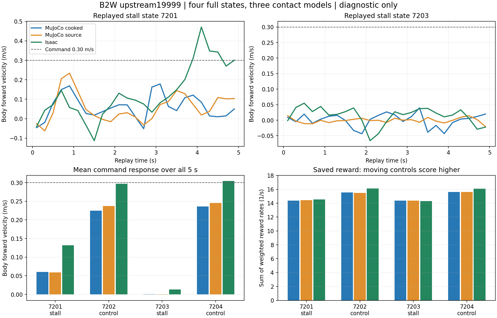

# Upstream19999: воспроизведение застреваний и разбор награды

25 сентября 2026. **Этап выполнен; policy не принята, PPO не запускался.**
Только upstream19999, ABI57→16, внешний body-frame command `(0.3,0,0)`, 50 Hz.
Upstream10000 не запускался. Работа выполнена локально на RTX4080 Laptop/CPU.

Главный результат: одно из застреваний переносится из MuJoCo в Isaac и сохраняется
в обоих вариантах MuJoCo. Это уже не только различие общего stair score между
движками: policy не выходит из конкретного доступного ей состояния. Другое
застревание в Isaac к концу replay начинает разрешаться. Общего доказательства
равенства контактных моделей или физической достоверности относительно B2W нет.

## Протокол и воспроизводимость

Исходный [план replay](../../configs/locomotion57_19999_replay_plan_20260925.json)
сохранён неизменным как предварительный документ. Запуск фиксирует отдельный
[execution config](../../configs/replay57_19999_execution_20260925.json).
Checkpoint SHA-256: `e2ff3b7b5543e008e30bd3981b0d639a650eb187ef1412d399ac6c26a9557dcc`.
Export SHA-256: `f2ce3266dac64d44f06dcb8e336470da4b33e33bb38cdd21b73b9b200d809bff`.

- Четыре исходных 45-секундных эпизода повторены с cooked geometry: seeds7201–7204,
  `up_14x32 / forward_0.30`. Basic traces совпали с contact57b **точно**, max error0.
- На границе policy step в27.0s сохранены root link pose, COM linear velocity в world,
  angular velocity в world, q/dq в ABI order, previous raw action, physical targets,
  `mjSTATE_INTEGRATION` включая warmstart и первоначальный sensor cache.
- Четыре проверки сериализованного продолжения воспроизвели следующие5s исходной
  трассы **точно**, max error0, включая все71 поля root pose/q/dq/torques/targets
  прежнего detail trace. Проверка отдельно учитывается как software validation.
- Выполнены12 полных replay:4 состояния × Isaac nominal / MuJoCo cooked / MuJoCo source.
  Physics dt2ms, policy dt20ms, horizon5s. Fresh solver contacts во всех трёх условиях.
  В Isaac ошибка восстановления pose≤1.20e−7; q/dq и COM velocities восстановлены точно
  в float32. Solver cache MuJoCo в Isaac не переносился.

Состояния7201/7203 выбраны как stalls,7202/7204 — движущиеся контроли. Это отобранные
диагностические состояния, не случайная qualification sample. За5s не проверяется
непрерывный ноль и не назначается новый pass/fail по полному locomotion57_v1.
World displacement ниже — диагностическая величина, не навигационный gate.

## Движение из одинаковых состояний

Средняя body-frame скорость `vx`, м/с; команда во всех случаях0.30:

| Состояние | MuJoCo cooked | MuJoCo source | Isaac | Последняя секунда Isaac |
|---|---:|---:|---:|---:|
| 7201, stall | 0.0606 | 0.0591 | 0.1317 | 0.3466 |
| 7202, control | 0.2247 | 0.2375 | 0.2972 | 0.3011 |
| 7203, stall | 0.0005 | −0.0007 | 0.0135 | 0.0009 |
| 7204, control | 0.2363 | 0.2454 | 0.3042 | 0.3088 |

У7201 Isaac даёт позднее восстановление, тогда как обе MuJoCo-модели продолжают
мало продвигаться: world Δx за5s равен0.478/0.013/0.098m соответственно.
У7203 Δx=0.072/0.002/−0.004m; финальная скорость практически нулевая во всех моделях.
Переключение source/cooked geometry в уже застрявшем состоянии проблему не снимает.
Это не опровергает влияние геометрии на вероятность **попадания** в такое состояние.

## Контакты и приводы

Скольжение вычислено в физических точках контакта: скорость COM колеса плюс
`omega × (point − COM)`, затем проекция на касательную плоскость. В MuJoCo использован
contact-point Jacobian. Прокси `radius × wheel_speed − base_speed` здесь не применяется.
Порог нормальной силы5N зафиксирован до измерений; итог — RMS, взвешенный по нормальной
нагрузке, за все2500 physics steps. Порядок колёс FR/FL/RR/RL.

Для состояния7203:

| Модель | Slip FR, м/с | Slip FL, м/с | Нагрузка FR / FL, N | FL saturation, % |
|---|---:|---:|---:|---:|
| MuJoCo cooked | 0.821 | 0.343 | 109 / 299 | 64.88 |
| MuJoCo source | 0.809 | 0.317 | 96 / 353 | 65.04 |
| Isaac | 1.029 | 0.259 | 114 / 327 | 97.44 |

Задние колёса7203 почти не скользят:0.004–0.009m/s. В движущихся контролях максимум
RMS среди колёс составляет0.096m/s в MuJoCo и0.044m/s в Isaac. Сочетание пробуксовки
одного переднего колеса и длительного насыщения другого подтверждено измерениями;
повышение torque limit или wheel gain из этого не следует.

Saturation означает `abs(tau)≥19.8Nm`,99% simulator wheel effort limit20Nm.
**Isaac applied torque для implicit wheels — оценка PD, MuJoCo — solver actuator force**;
проценты не являются измерением реального тока и не доказывают равенства нагрузок.
Requested/applied torques всех16 приводов сохранены на каждом physics step.
Unsafe predicates существующего development protocol не сработали: **0/12**.
Это не закрывает torque/current/thermal gates реального B2W.

## Все17 компонентов награды

Восстановлены функции, веса и параметры из сохранённого `env.yaml` именно19999.
Isaac RewardManager вычислял реальные upstream functions. Offline proxy для обеих
MuJoCo-трасс использует те же функции; на1000 Isaac policy samples расхождение каждого
компонента с live manager≤9.54e−7. Учитываются последние3 physics samples контактов,
последняя physics-step acceleration и previous raw action, включая первый replay step.

Таблица показывает сумму weighted reward **rates**, а не episode return.
Интеграл за5s равен сумме по250 шагам, умноженной на0.02, и сохранён по каждому терму.

| Состояние | MuJoCo cooked | MuJoCo source | Isaac |
|---|---:|---:|---:|
| 7201, stall | 14.365 | 14.440 | 14.539 |
| 7202, control | 15.536 | 15.474 | 16.132 |
| 7203, stall | 14.380 | 14.375 | 14.300 |
| 7204, control | 15.610 | 15.630 | 16.089 |

У7203 в Isaac: linear tracking +2.156/s, yaw tracking +1.497/s, upward +11.695/s,
posture −0.652/s, leg torque −0.240/s, contact force −0.116/s. Все остальные термы,
полные интегралы и аналогичные строки обоих MuJoCo-профилей — в evidence.

При команде0.3 нормы команды хватает для отключения `stand_still`; усиление posture
penalty ×5 тоже **не активно**. На этих данных движущиеся контроли получают больше
награды. Значит, утверждение «reward делает stall выгоднее движения» не подтверждено.
Высокий почти постоянный upward≈12/s сам по себе не доказывает неправильный градиент:
нужна причинная проверка, а здесь сравниваются разные позы и участки лестницы.
Приводимые суммы — диагностический ledger при dt2ms и фиксированной команде;
это не реконструкция полного исходного training return с randomization/terminations.

## Технические попытки и ограничения

Первый запуск остановился до rollout на безопасном YAML loader: понадобился inert
`python/tuple`. Исправление не разрешает произвольные Python objects/functions.
Первый полный Isaac batch сохранил движение и rewards, но контактный filter указывал
на Xform `/World/ground/terrain`; PhysX не выдал контакты. Эти4 replay сохранены как
неполные, не добавлены к12 валидным. Две короткие попытки direct contact reports
по4 env×0.12s также не дали данных и были остановлены.

Рабочее исправление — filter на реальный collider `/World/ground/terrain/mesh`.
Физика не изменена; траектория исправленного batch **точно** совпала с первым Isaac
batch. Получено до13 точек на wheel/terrain pair при capacity64. Использованы
отдельные sensors для каждого колеса, чтобы сохранить однозначный mapping.
Семантика API проверена по [PhysX tensors107.3](https://docs.omniverse.nvidia.com/kit/docs/omni_physics/107.3/extensions/runtime/source/omni.physics.tensors/docs/api/python.html)
и установленному `terrain_importer`/`create_prim_from_mesh`.

MuJoCo отдаёт contact solver/cached poses и post-integration velocity с разницей
стадий до2ms; это ограничение точности slip, а не идентичная схема измерений двух
движков. Full-state replay точен только для отдельной same-engine warm проверки.
При свежем контакте и другой геометрии первые transient samples включены в метрики,
не исключены как «grace». Отдельный ledger после первых100ms также сохранён.

## Решение по дальнейшему обучению

Следующий **единственный** PPO treatment —20% reset в записанные failure states
в подходящей части stair environments, control0%. Это проверка гипотезы о недостатке
опыта восстановления из таких состояний; она пока не доказана. Все rewards,
actuator gains/limits, ABI, exploration и остальная задача одинаковы у обоих arms.
Готов [план pilot](../../configs/locomotion57_19999_recovery_pilot_plan_20260925.json).

До PPO требуется подготовить общую velocity task с точным14×32cm stair subset,
проверить восстановление previous action и stochastic safety с фактическим loaded std,
сохранить training critic/height scan. Replay evaluator с отключённым critic не является
готовым training task. Начальный бюджет:50 новых updates ×2 arms ×2 seeds83/84,
4096×24 rollout,19,660,800 transitions, общий wall-clock cap2h. Серверный запуск этим
документом не разрешается.

Primary metric — худшая stair command-tracking строка на **независимых** reset seeds;
training states7201/7203 остаются вторичной диагностикой. Закрытую failure-state
выборку нужно собрать и зафиксировать до обучения. Сохранены regression gates Flat,
Rough, small commands, transitions, continuous zero и safety. Допуска на hardware нет.

## Артефакты

- [Сводка, все компоненты и SHA](evidence/replay57_19999_20260925/summary.json).
- [Проверка inputs/traces,290 tests,226 ссылок и hashes runtime logs](evidence/replay57_19999_20260925/validation.json).
- Полные state/physics traces: `logs/replay57_19999_20260925/`,9 JSON/NPZ pairs,
  включая неполный Isaac batch и separate reward ledgers. Логи не включаются в Git.
- Scripts: `replay57_protocol.py`, `replay57_mujoco.py`, `replay57_rewards.py`,
  `replay57_isaac.py`, проверенный launcher `replay57_contactmesh.py`,
  `replay57_summary.py`, `plot_replay57.py`. Неудачный direct-report wrapper сохранён
  как диагностическая попытка, не как рекомендуемый launcher.
- Tests проверяют COM/link velocity conversion, неизменность live sensor cache,
  различение качения и вращения со скольжением, отказ от executable YAML tags.
  Полный suite:290 tests — OK;1290 файлов6 vendor snapshots не изменены.
