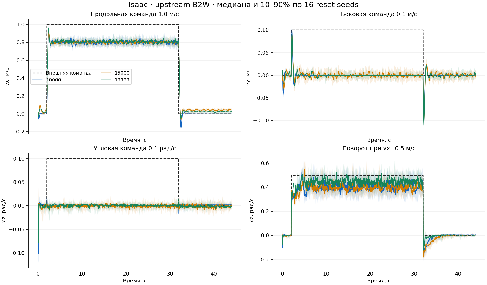

# Upstream 10000 / 15000 / 19999: locomotion57_v1

Development-проверка 25 сентября 2026 по внешним body-frame командам скорости.
Никакой маршрутной коррекции, goal brake, wheel latch или stop controller.
Тот же TorchScript export в Isaac и MuJoCo, 50 Hz; safety на каждом physics step.

## Итог

| Движок | Checkpoint | Flat | Rough | Stairs | Unsafe всего |
|---|---:|---:|---:|---:|---:|
| Isaac | 10000 | 138/320 | 207/256 | 181/288 | 4 |
| Isaac | 15000 | 125/320 | 170/256 | 166/288 | 1 |
| Isaac | 19999 | 150/320 | 240/256 | 275/288 | 0 |
| MuJoCo | 10000 | 138/320 | 211/256 | 157/288 | 18 |
| MuJoCo | 15000 | 112/320 | 138/256 | 125/288 | 22 |
| MuJoCo | 19999 | 182/320 | 203/256 | 116/288 | 21 |

Это число эпизодов, выполнивших все применимые low-level gates. Суммарная доля
приведена для обзора; приемка проверяется по каждой terrain×command строке.
Прерванный unsafe эпизод остается в denominator; непроверенные последующие
сегменты не засчитываются как успешная остановка или tracking.

**Все три checkpoint отклонены в development-screen.** У каждого есть строки,
не достигшие обязательной доли успешных эпизодов. Полная qualification также
не закрыта; этот вывод не меняется при исключении навигационных критериев.

| Checkpoint | Не прошедшие строки из 108 | Решение |
|---|---:|---|
| 10000 | 57 | Не принят |
| 15000 | 66 | Не принят |
| 19999 | 48 | Не принят |

19999 дает лучший агрегат в Isaac, особенно на лестницах. Его преимущество
не переносится на все MuJoCo strata: на Rough 10000 проходит 211/256 эпизодов,
19999 — 203/256, 15000 — 138/256. Это основание сначала локализовать
physics/actuator mismatch, а не выбирать checkpoint только по Isaac score.

## Основные отказы исполнения команд

- Все три политики в обоих движках имеют 0/16 success в каждой из четырех строк малых боковых/угловых команд: `vy=±0.10 m/s`, `omega_z=±0.10 rad/s`. Отклик недостаточен по precision gate.
- В Isaac все три проходят `vx=±0.5 m/s` (16/16 в каждой строке), но не проходят `vx=1.0 m/s` (0/16). Фактическая скорость около 0.8 m/s; ошибка и отдельные moving windows выходят за допуски.
- Есть отказы переходов и удержания внешнего нуля на рельефе. Они возникают без goal brake, route correction и требования остановиться в конкретной точке.
- Unsafe ниже — нарушение предиката симулятора. Compiled hard joint range не объявляется измеренным аппаратным пределом B2W.

| Движок | Checkpoint | Tracking | Переходы | Нулевые команды | Застревание | Unsafe: причины |
|---|---:|---:|---:|---:|---:|---|
| Isaac | 10000 | 229 | 226 | 30 | 55 | hard_joint_position: 4 |
| Isaac | 15000 | 223 | 228 | 76 | 55 | hard_joint_position: 1 |
| Isaac | 19999 | 112 | 104 | 14 | 0 | 0 |
| MuJoCo | 10000 | 172 | 222 | 71 | 28 | hard_joint_position: 16, base_hip_contact: 2 |
| MuJoCo | 15000 | 256 | 275 | 106 | 26 | hard_joint_position: 7, base_hip_contact: 15 |
| MuJoCo | 19999 | 174 | 222 | 108 | 19 | hard_joint_position: 13, base_hip_contact: 8 |

Столбцы — все failure flags, поэтому один эпизод может попадать в несколько
столбцов. Для единственного outcome используется приоритет unsafe → tracking →
transition → standstill → terrain stall. Unsafe эпизоды не исключены из статистики.

На подъемах MuJoCo отдельно: 10000 — 61/144, 15000 — 15/144,
19999 — 14/144. Помимо превышения compiled joint range, здесь возникают
запрещенные контакты base/hip. Поэтому разница с Isaac не сводится
к статистической погрешности общего success score.

Для дальнейшей диагностики сохранить 19999 как сильный Isaac baseline,
а 10000 — как обязательный парный контроль sim2sim. 15000 не дает основания
заменить эти контрольные точки. Сначала разделить влияние physics/actuator
model и policy на одном frozen protocol, затем выбирать parent для PPO A/B.

## Протокол и границы выводов

- 54 сценария × 16 одинаковых reset seeds × 3 checkpoint × 2 движка = 5184 эпизода.
- Flat: ноль, ±vx/±vy/±omega_z, малые команды ±0.1, диагональ, поворот с движением, реверс, ramp и боковые возмущения.
- Rough: отдельные random rough, obstacles, inverse stairs и склоны ±8°. Это фиксированные project-owned геометрии; не полная upstream terrain distribution.
- Stairs: up/down 12×38, 14×32 и 16×29 cm, по 6 ступеней; внешние скорости 0.3/0.7 m/s и остановка/повторный старт по времени.
- Обычный segment 30 s, ноль 10 s после settling; короткий 4 s approach используется только в сценарии прерывания движения на рельефе.
- Reset variations: XY ±0.04 m, yaw ±0.04 rad, leg positions ±0.015 rad, joint velocities ±0.03 rad/s. Масса, gains, friction и sensor noise не рандомизировались.
- Возмущение: однократное добавление world-frame lateral velocity 0.35 m/s в t=10 s; это кинематический push probe, не измеренный импульс силы.
- Safety: tilt >60°, net base/hip contact >5 N, non-finite и выход за compiled hard joint range более чем на 0.001 rad. Startup grace отсутствует. No-load speed только диагностируется.
- Ограничения моделей различаются. Это исходный sim2sim transfer test; canonical physics parity, torque/current/thermal limits реального B2W не подтверждены.
- Compiled mass: Isaac 82.419853 kg, MuJoCo 87.170292 kg. Calf effort limits: Isaac 320 Nm, MuJoCo ctrlrange 300 Nm. Исходные модели и vendor не исправлялись внутри сравнения.
- Isaac wheel torque — оценка implicit PD actuator; MuJoCo — actuator_force после ctrlrange clipping. Их RMS/saturation нельзя объявлять эквивалентными измерениями реального тока.
- Per-joint RMS, p99-bin upper bound, peak, saturation, slew и rolling residual proxy сохранены в `actuator_rows` evidence. Это maxima/medians по эпизодам; episode p99 maximum не является pooled p99. Contact impulse и полноценный contact-aware slip пока не измеряются.
- Три checkpoint — milestones одного обучения. Это не три независимых training seeds. 16/16 в строке недостаточно для финальной статистической qualification.
- Hardware, latency/watchdog, full DR и закрытая validation не выполнялись; новых training updates нет.

## Отклик на внешние команды

График показывает все 16 reset seeds: медиану и диапазон 10–90%, без отбора успешных эпизодов.
Слабый отклик на малые боковые/угловые команды согласуется с возможным конфликтом rewards:
в сохраненном `env.yaml` `joint_pos_penalty` имеет `command_threshold=0.1`,
`velocity_threshold=0.5`, `stand_still_scale=5`. Исходная функция усиливает штраф
отклонения ног, когда обе величины не превышают порог. Это гипотеза о причине,
а не доказанная причинность; веса, rewards и пороги теста не менялись.
[Функция reward](../../vendor/robot_lab/source/robot_lab/robot_lab/tasks/manager_based/locomotion/velocity/mdp/rewards.py).

## Проверки реализации

Перед основным screen прошли 277 unit tests, включая 10 новых проверок ложного pass
при неподвижности, позднем разгоне после нуля, substep limit violation и смешении
no-load speed с hard limit. Проверены 1290 vendor-файлов. CPU checkpoint/export
parity трех checkpoints имеет max absolute error 0.0; в Isaac начальная live
observation construction совпала с upstream observation manager с ошибкой 0.0.
Это не заменяет измерение deployment latency и hardware adapter fault injection.

## Каждая строка development

| Движок | Terrain | Команда/сценарий | 10000 success / unsafe | 15000 success / unsafe | 19999 success / unsafe |
|---|---|---|---:|---:|---:|
| Isaac | flat | stand | 16/16 / 0 | 16/16 / 0 | 16/16 / 0 |
| Isaac | flat | vx_-0.50 | 16/16 / 0 | 16/16 / 0 | 16/16 / 0 |
| Isaac | flat | vx_+0.50 | 16/16 / 0 | 16/16 / 0 | 16/16 / 0 |
| Isaac | flat | vx_+1.00 | 0/16 / 0 | 0/16 / 0 | 0/16 / 0 |
| Isaac | flat | vy_-0.20 | 0/16 / 0 | 0/16 / 0 | 0/16 / 0 |
| Isaac | flat | vy_+0.20 | 0/16 / 0 | 0/16 / 0 | 0/16 / 0 |
| Isaac | flat | wz_-0.50 | 0/16 / 0 | 0/16 / 0 | 3/16 / 0 |
| Isaac | flat | wz_+0.50 | 0/16 / 0 | 3/16 / 0 | 13/16 / 0 |
| Isaac | flat | precision_vx_-0.10 | 16/16 / 0 | 0/16 / 0 | 0/16 / 0 |
| Isaac | flat | precision_vx_+0.10 | 16/16 / 0 | 16/16 / 0 | 16/16 / 0 |
| Isaac | flat | precision_vy_-0.10 | 0/16 / 0 | 0/16 / 0 | 0/16 / 0 |
| Isaac | flat | precision_vy_+0.10 | 0/16 / 0 | 0/16 / 0 | 0/16 / 0 |
| Isaac | flat | precision_wz_-0.10 | 0/16 / 0 | 0/16 / 0 | 0/16 / 0 |
| Isaac | flat | precision_wz_+0.10 | 0/16 / 0 | 0/16 / 0 | 0/16 / 0 |
| Isaac | flat | diagonal | 0/16 / 0 | 0/16 / 0 | 6/16 / 0 |
| Isaac | flat | turning | 10/16 / 0 | 10/16 / 0 | 16/16 / 0 |
| Isaac | flat | reverse | 16/16 / 0 | 16/16 / 0 | 16/16 / 0 |
| Isaac | flat | ramp | 0/16 / 0 | 0/16 / 0 | 0/16 / 0 |
| Isaac | flat | push_moving | 16/16 / 0 | 16/16 / 0 | 16/16 / 0 |
| Isaac | flat | push_standing | 16/16 / 0 | 16/16 / 0 | 16/16 / 0 |
| Isaac | random_rough | forward_0.30 | 14/16 / 0 | 15/16 / 0 | 16/16 / 0 |
| Isaac | random_rough | forward_0.70 | 16/16 / 0 | 16/16 / 0 | 16/16 / 0 |
| Isaac | random_rough | interrupted | 16/16 / 0 | 0/16 / 0 | 11/16 / 0 |
| Isaac | random_rough | push_moving | 13/16 / 0 | 15/16 / 0 | 16/16 / 0 |
| Isaac | obstacles | forward_0.30 | 16/16 / 0 | 16/16 / 0 | 16/16 / 0 |
| Isaac | obstacles | forward_0.70 | 16/16 / 0 | 16/16 / 0 | 16/16 / 0 |
| Isaac | obstacles | interrupted | 3/16 / 0 | 8/16 / 0 | 16/16 / 0 |
| Isaac | inverse | forward_0.30 | 0/16 / 0 | 0/16 / 0 | 6/16 / 0 |
| Isaac | inverse | forward_0.70 | 12/16 / 0 | 2/16 / 0 | 16/16 / 0 |
| Isaac | inverse | interrupted | 5/16 / 0 | 2/16 / 0 | 15/16 / 0 |
| Isaac | slope_up | forward_0.30 | 16/16 / 0 | 16/16 / 0 | 16/16 / 0 |
| Isaac | slope_up | forward_0.70 | 16/16 / 0 | 16/16 / 0 | 16/16 / 0 |
| Isaac | slope_up | interrupted | 16/16 / 0 | 0/16 / 0 | 16/16 / 0 |
| Isaac | slope_down | forward_0.30 | 16/16 / 0 | 16/16 / 0 | 16/16 / 0 |
| Isaac | slope_down | forward_0.70 | 16/16 / 0 | 16/16 / 0 | 16/16 / 0 |
| Isaac | slope_down | interrupted | 16/16 / 0 | 16/16 / 0 | 16/16 / 0 |
| Isaac | up_12x38 | forward_0.30 | 15/16 / 0 | 0/16 / 0 | 14/16 / 0 |
| Isaac | up_12x38 | forward_0.70 | 12/16 / 0 | 6/16 / 0 | 16/16 / 0 |
| Isaac | up_12x38 | interrupted | 16/16 / 0 | 9/16 / 0 | 16/16 / 0 |
| Isaac | down_12x38 | forward_0.30 | 4/16 / 0 | 16/16 / 0 | 16/16 / 0 |
| Isaac | down_12x38 | forward_0.70 | 16/16 / 0 | 16/16 / 0 | 16/16 / 0 |
| Isaac | down_12x38 | interrupted | 16/16 / 0 | 14/16 / 0 | 16/16 / 0 |
| Isaac | up_14x32 | forward_0.30 | 1/16 / 0 | 0/16 / 0 | 14/16 / 0 |
| Isaac | up_14x32 | forward_0.70 | 9/16 / 0 | 12/16 / 0 | 14/16 / 0 |
| Isaac | up_14x32 | interrupted | 15/16 / 0 | 5/16 / 0 | 15/16 / 0 |
| Isaac | down_14x32 | forward_0.30 | 0/16 / 0 | 16/16 / 0 | 16/16 / 0 |
| Isaac | down_14x32 | forward_0.70 | 16/16 / 0 | 16/16 / 0 | 16/16 / 0 |
| Isaac | down_14x32 | interrupted | 16/16 / 0 | 6/16 / 0 | 16/16 / 0 |
| Isaac | up_16x29 | forward_0.30 | 0/16 / 0 | 0/16 / 0 | 14/16 / 0 |
| Isaac | up_16x29 | forward_0.70 | 8/16 / 3 | 8/16 / 1 | 15/16 / 0 |
| Isaac | up_16x29 | interrupted | 9/16 / 1 | 8/16 / 0 | 13/16 / 0 |
| Isaac | down_16x29 | forward_0.30 | 0/16 / 0 | 16/16 / 0 | 16/16 / 0 |
| Isaac | down_16x29 | forward_0.70 | 16/16 / 0 | 16/16 / 0 | 16/16 / 0 |
| Isaac | down_16x29 | interrupted | 12/16 / 0 | 2/16 / 0 | 16/16 / 0 |
| MuJoCo | flat | stand | 16/16 / 0 | 16/16 / 0 | 16/16 / 0 |
| MuJoCo | flat | vx_-0.50 | 16/16 / 0 | 16/16 / 0 | 16/16 / 0 |
| MuJoCo | flat | vx_+0.50 | 16/16 / 0 | 16/16 / 0 | 16/16 / 0 |
| MuJoCo | flat | vx_+1.00 | 0/16 / 0 | 0/16 / 0 | 0/16 / 0 |
| MuJoCo | flat | vy_-0.20 | 0/16 / 0 | 0/16 / 0 | 0/16 / 0 |
| MuJoCo | flat | vy_+0.20 | 0/16 / 0 | 0/16 / 0 | 0/16 / 0 |
| MuJoCo | flat | wz_-0.50 | 0/16 / 0 | 0/16 / 0 | 12/16 / 0 |
| MuJoCo | flat | wz_+0.50 | 5/16 / 0 | 16/16 / 0 | 16/16 / 0 |
| MuJoCo | flat | precision_vx_-0.10 | 16/16 / 0 | 0/16 / 0 | 16/16 / 0 |
| MuJoCo | flat | precision_vx_+0.10 | 16/16 / 0 | 0/16 / 0 | 16/16 / 0 |
| MuJoCo | flat | precision_vy_-0.10 | 0/16 / 0 | 0/16 / 0 | 0/16 / 0 |
| MuJoCo | flat | precision_vy_+0.10 | 0/16 / 0 | 0/16 / 0 | 0/16 / 0 |
| MuJoCo | flat | precision_wz_-0.10 | 0/16 / 0 | 0/16 / 0 | 0/16 / 0 |
| MuJoCo | flat | precision_wz_+0.10 | 0/16 / 0 | 0/16 / 0 | 0/16 / 0 |
| MuJoCo | flat | diagonal | 0/16 / 0 | 0/16 / 0 | 16/16 / 0 |
| MuJoCo | flat | turning | 5/16 / 0 | 0/16 / 0 | 10/16 / 0 |
| MuJoCo | flat | reverse | 16/16 / 0 | 16/16 / 0 | 16/16 / 0 |
| MuJoCo | flat | ramp | 0/16 / 1 | 0/16 / 0 | 0/16 / 2 |
| MuJoCo | flat | push_moving | 16/16 / 0 | 16/16 / 0 | 16/16 / 0 |
| MuJoCo | flat | push_standing | 16/16 / 0 | 16/16 / 0 | 16/16 / 0 |
| MuJoCo | random_rough | forward_0.30 | 16/16 / 0 | 16/16 / 0 | 16/16 / 0 |
| MuJoCo | random_rough | forward_0.70 | 16/16 / 0 | 5/16 / 0 | 16/16 / 0 |
| MuJoCo | random_rough | interrupted | 16/16 / 0 | 0/16 / 0 | 0/16 / 0 |
| MuJoCo | random_rough | push_moving | 16/16 / 0 | 16/16 / 0 | 16/16 / 0 |
| MuJoCo | obstacles | forward_0.30 | 16/16 / 0 | 16/16 / 0 | 16/16 / 0 |
| MuJoCo | obstacles | forward_0.70 | 14/16 / 0 | 1/16 / 0 | 10/16 / 0 |
| MuJoCo | obstacles | interrupted | 16/16 / 0 | 0/16 / 0 | 16/16 / 0 |
| MuJoCo | inverse | forward_0.30 | 5/16 / 0 | 4/16 / 0 | 16/16 / 0 |
| MuJoCo | inverse | forward_0.70 | 0/16 / 0 | 0/16 / 0 | 1/16 / 0 |
| MuJoCo | inverse | interrupted | 0/16 / 0 | 0/16 / 0 | 0/16 / 0 |
| MuJoCo | slope_up | forward_0.30 | 16/16 / 0 | 16/16 / 0 | 16/16 / 0 |
| MuJoCo | slope_up | forward_0.70 | 16/16 / 0 | 16/16 / 0 | 16/16 / 0 |
| MuJoCo | slope_up | interrupted | 16/16 / 0 | 0/16 / 0 | 16/16 / 0 |
| MuJoCo | slope_down | forward_0.30 | 16/16 / 0 | 16/16 / 0 | 16/16 / 0 |
| MuJoCo | slope_down | forward_0.70 | 16/16 / 0 | 16/16 / 0 | 16/16 / 0 |
| MuJoCo | slope_down | interrupted | 16/16 / 0 | 16/16 / 0 | 16/16 / 0 |
| MuJoCo | up_12x38 | forward_0.30 | 16/16 / 0 | 14/16 / 0 | 6/16 / 0 |
| MuJoCo | up_12x38 | forward_0.70 | 0/16 / 0 | 0/16 / 2 | 0/16 / 2 |
| MuJoCo | up_12x38 | interrupted | 10/16 / 0 | 0/16 / 0 | 1/16 / 0 |
| MuJoCo | down_12x38 | forward_0.30 | 16/16 / 0 | 16/16 / 0 | 16/16 / 0 |
| MuJoCo | down_12x38 | forward_0.70 | 16/16 / 0 | 16/16 / 0 | 16/16 / 0 |
| MuJoCo | down_12x38 | interrupted | 0/16 / 0 | 0/16 / 0 | 0/16 / 0 |
| MuJoCo | up_14x32 | forward_0.30 | 15/16 / 0 | 0/16 / 0 | 3/16 / 0 |
| MuJoCo | up_14x32 | forward_0.70 | 0/16 / 3 | 0/16 / 2 | 0/16 / 5 |
| MuJoCo | up_14x32 | interrupted | 4/16 / 0 | 0/16 / 0 | 0/16 / 0 |
| MuJoCo | down_14x32 | forward_0.30 | 16/16 / 0 | 16/16 / 0 | 16/16 / 0 |
| MuJoCo | down_14x32 | forward_0.70 | 16/16 / 0 | 16/16 / 0 | 16/16 / 0 |
| MuJoCo | down_14x32 | interrupted | 0/16 / 0 | 5/16 / 0 | 0/16 / 0 |
| MuJoCo | up_16x29 | forward_0.30 | 10/16 / 1 | 0/16 / 0 | 4/16 / 3 |
| MuJoCo | up_16x29 | forward_0.70 | 0/16 / 8 | 0/16 / 14 | 0/16 / 3 |
| MuJoCo | up_16x29 | interrupted | 6/16 / 5 | 1/16 / 4 | 0/16 / 6 |
| MuJoCo | down_16x29 | forward_0.30 | 16/16 / 0 | 16/16 / 0 | 16/16 / 0 |
| MuJoCo | down_16x29 | forward_0.70 | 16/16 / 0 | 16/16 / 0 | 16/16 / 0 |
| MuJoCo | down_16x29 | interrupted | 0/16 / 0 | 9/16 / 0 | 6/16 / 0 |

## Воспроизводимость

- [Замороженный protocol/config](../../configs/locomotion57_v1_upstream_development.json).
- [Агрегаты, решения, исходные hashes и compiled models](evidence/upstream_locomotion57_20260925/summary.json).
- [Каждый эпизод](evidence/upstream_locomotion57_20260925/episodes.csv).
- Полные JSON и NPZ traces остаются в `logs/locomotion57_upstream_20260925/development`; hashes сохранены в evidence.
- [Действующие критерии](../PROJECT_PLAN.md#acceptance-gates-низкоуровневая-locomotion-policy).
