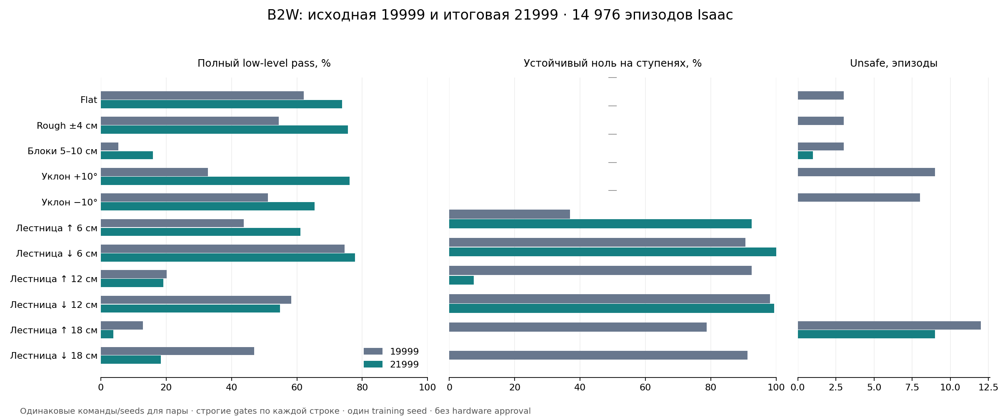

# 19999 → 21999: полное сравнение Flat/Rough/уклонов/лестниц

27 сентября 2026. Проверен фиксированный финальный checkpoint после ровно 2000 дополнительных updates.

**Выполнено 14976 эпизодов: 234 сценария × 32 reset seeds × 2 policies.** Полный pass: 3111→4212 из 7488 на модель; unsafe 38→10.

Строк с улучшением — 85, с ухудшением — 40; потеряно 11 строк, ранее проходивших 32/32. **Отсутствие потери навыков не подтверждено.**

Суммарные числа описывают конкретный набор, не являются gate и не компенсируют отказы отдельных строк.

## Геометрии

| Геометрия | Эпизодов на модель | Full 19999→21999 | С покрытием 19999→21999 | Unsafe 19999→21999 |
|---|---:|---:|---:|---:|
|Flat|1152|716→850|716→850|3→0|
|Rough ±4 см|1152|627→871|627→871|3→0|
|Блоки 5–10 см|1152|62→183|62→183|3→1|
|Уклон +10°|1152|378→877|378→877|9→0|
|Уклон −10°|1152|589→754|589→754|8→0|
|Лестница ↑ 6 см|288|126→176|126→176|0→0|
|Лестница ↓ 6 см|288|215→224|215→224|0→0|
|Лестница ↑ 12 см|288|58→55|58→55|0→0|
|Лестница ↓ 12 см|288|168→158|168→158|0→0|
|Лестница ↑ 18 см|288|37→11|37→11|12→9|
|Лестница ↓ 18 см|288|135→53|135→53|0→0|

## Flat и сохранение навыков

Свежая 19999 воспроизвела retained screen: {"changed_outcomes": 0, "changed_flags": 0}.

| Сценарий с регрессом | Full 19999 | Full 21999 |
|---|---:|---:|
|vy_-1.00|32/32|31/32|
|wz_-0.50|6/32|0/32|
|wz_+0.50|21/32|0/32|

Непрерывный ноль на Flat: 1079→1152/1152. Unsafe: 3→0. Пиковая wheel speed: 38.55→43.89 rad/s; максимальная доля насыщения wheel torque в одном эпизоде: 7.18%→3.23%.

## Наибольшие регрессы во всём наборе

| Геометрия | Сценарий | Full 19999→21999 | Δ |
|---|---|---:|---:|
|Лестница ↓ 12 см|backward_traverse|32→0|-32|
|Лестница ↓ 18 см|backward_traverse|32→0|-32|
|Лестница ↓ 18 см|stair_stop_restart_0.5|28→0|-28|
|Лестница ↑ 6 см|backward_traverse|32→10|-22|
|Flat|wz_+0.50|21→0|-21|
|Лестница ↓ 12 см|stair_stop_reverse|19→0|-19|
|Уклон −10°|wz_+0.50|17→0|-17|
|Лестница ↑ 18 см|stair_stop_reverse|17→0|-17|
|Уклон +10°|vy_-1.00|22→8|-14|
|Лестница ↑ 12 см|stair_stop_restart_0.5|21→8|-13|
|Лестница ↓ 18 см|traverse_0.3|13→0|-13|
|Уклон −10°|vy_+0.50|32→20|-12|
|Лестница ↑ 18 см|stair_stop_restart_0.5|10→0|-10|
|Rough ±4 см|vy_-0.70|30→21|-9|
|Уклон −10°|diagonal_-1_+1|15→6|-9|

## Остановка непосредственно на лестнице

| Геометрия | Объявленных окон на модель | Физически на ступенях 19999→21999 | На ступенях + устойчивый ноль |
|---|---:|---:|---:|
|Лестница ↑ 6 см|160|160→160|59→148|
|Лестница ↓ 6 см|160|160→160|145→160|
|Лестница ↑ 12 см|160|160→12|148→12|
|Лестница ↓ 12 см|160|160→160|157→159|
|Лестница ↑ 18 см|160|157→0|126→0|
|Лестница ↓ 18 см|160|156→0|146→0|

Покрытие не корректирует команды. Непопадание на ступени и остановка на площадке не подтверждают stair-stop навык. Финальная остановка после завершённого прохода может быть на площадке.

Дополнительный [разбор положения во время остановок](evidence/fullcycle_21999_20260927/stair_stop_position_audit.json) показывает, что при подходе vx=0.3 новая модель на подъёме 12/18 cm остаётся до первой кромки x=0.8 m (медиана x≈0.59/0.54 m); исходная находится на лестнице (≈1.16/1.12 m). На спуске 18 cm новая уходит к нижней площадке (≈4.25 m при последней кромке 4.1 m), исходная остаётся на марше (≈1.36 m). Это наблюдение по traces, а не установленная физическая причина изменения поведения.

## Safety и приводы

| Метрика по всем сценариям | 19999 | 21999 |
|---|---:|---:|
|Unsafe|38|10|
|Минимальный hard joint margin, rad|-0.009694|-0.010416|
|Пиковая wheel speed, rad/s|85.75|56.55|
|Наибольшая wheel torque saturation fraction за эпизод|0.8003|0.5545|
|Наибольшая непрерывная wheel saturation, s|26.345|23.760|
|Пиковый наклон, °|43.98|40.20|
|Пиковая base/hip contact force, N|0.00|0.00|

Причины unsafe: 19999 — {"hard_joint_position": 38}; 21999 — {"hard_joint_position": 10}.

Показатели всех 16 приводов и каждой геометрии: [actuators.csv](evidence/fullcycle_21999_20260927/actuators.csv). P99 — максимум эпизодных гистограммных p99, не pooled percentile. Wheel applied torque является оценкой implicit PD; current/thermal/hardware torque-speed limits не проверялись. Wheel speed минус vx не выдаётся за физический tyre slip.

## Воспроизводимость и границы вывода

Использован deterministic actor, nominal physics и upright perturbations, без training DR/noise. Команды body-frame заданы только временем. Старый Flat использует seeds 8201–8232, новые terrains — 10201–10232. Геометрия зафиксирована до запуска; rough содержит level spawn 1×1 m, boxes — свободную стартовую площадку. 32/32 не доказывает 99% надёжность и эта пара policies не оценивает variance между training seeds.

Все terrain результаты пересчитаны по сохранённым velocity traces без новой симуляции: 12672 совпадений outcome/flags/segments. Export parity 295 inputs: max abs 0.0. 58 unit tests и verification 1463 vendor files прошли; retained evidence 19999 сохранилось и пересчитано для 1152 эпизодов. Проверка provenance охватывает server checkpoints и локальные development candidates, сверяет каждый SHA и связь checkpoint/export; этот технический контроль не предоставляет acceptance policy.

Исходные gates: RMSE≤(0.20,0.20,0.25), response≥80%, moving windows после 2 s, continuous zero≤0.10 m/s и 0.10 rad/s в течение 10 s. Safety 200 Hz: finite, tilt≤60°, base/hip contact≤5 N и hard range tolerance 0.001 rad. Unsafe/incomplete не исключены из denominator.

- [Объявленный протокол](../experiments/21999_full_validation_20260927.md).
- [Все 234 строки](evidence/fullcycle_21999_20260927/all_scenarios.md).
- [Численные результаты и hashes raw JSON/NPZ](evidence/fullcycle_21999_20260927/summary.json).
- [Табличные данные](evidence/fullcycle_21999_20260927/rows.csv).

Raw JSON/NPZ находятся в `logs/fullcycle21999_validation_20260927/`; их точные SHA записаны в summary. Исходная policy 19999 и retained evidence не изменены. Это Isaac development comparison; MuJoCo sim2sim, SDK2 transport и hardware qualification не выполнены этим набором.
