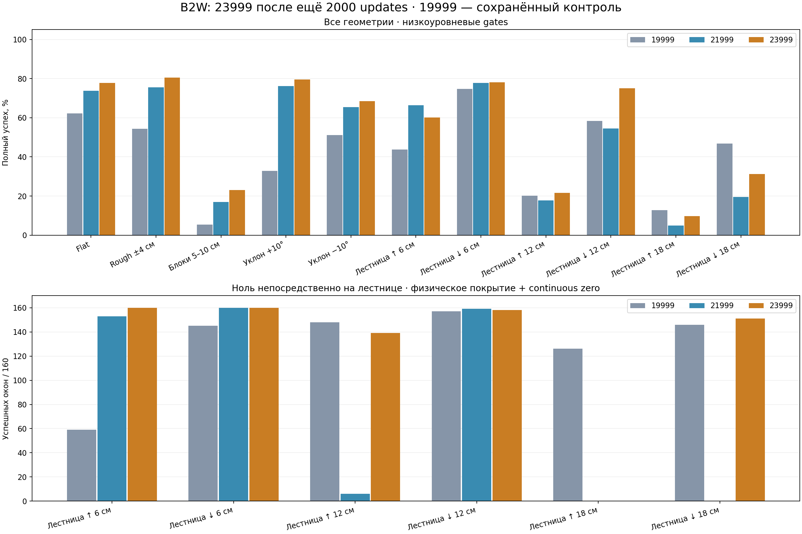

# 23999: результат локального recovery-run

27 сентября 2026. Финальный checkpoint после ровно 2000 updates от 21999, seed 9703.

**Выполнено 14 976 новых эпизодов:** 234 сценария × 32 seeds × 2 policies (21999/23999). 19999 — сохранённый контроль предыдущего полного теста, ещё 7488 эпизодов в сравнении.

Full pass: **3111 / 4240 / 4589 из 7488** для 19999 / 21999 / 23999. Unsafe: **38 / 11 / 3**.

К 21999: улучшенных строк — 53, ухудшенных — 43, потерянных прежних 32/32 — 9. К 19999: улучшенных — 102, ухудшенных — 26, потерянных прежних 32/32 — 8.

**Отсутствие потери навыков не подтверждено.** Общая сумма не компенсирует регрессы отдельных строк.

## Геометрии

| Геометрия | Эпизодов на модель | Full 19999 | Full 21999 | Full 23999 | Unsafe 19999 / 21999 / 23999 |
|---|---:|---:|---:|---:|---:|
|Flat|1152|716|850|896|3 / 0 / 0|
|Rough ±4 см|1152|627|871|928|3 / 0 / 0|
|Блоки 5–10 см|1152|62|195|266|3 / 0 / 1|
|Уклон +10°|1152|378|877|917|9 / 0 / 0|
|Уклон −10°|1152|589|754|788|8 / 0 / 0|
|Лестница ↑ 6 см|288|126|191|173|0 / 0 / 0|
|Лестница ↓ 6 см|288|215|224|225|0 / 0 / 0|
|Лестница ↑ 12 см|288|58|51|62|0 / 0 / 0|
|Лестница ↓ 12 см|288|168|157|216|0 / 0 / 0|
|Лестница ↑ 18 см|288|37|14|28|12 / 11 / 2|
|Лестница ↓ 18 см|288|135|56|90|0 / 0 / 0|

## Приоритетные Flat-команды

| Сценарий | 19999 | 21999 | 23999 |
|---|---:|---:|---:|
|stand|32/32|32/32|32/32|
|vx_+1.00|0/32|19/32|0/32|
|vy_-0.30|0/32|0/32|0/32|
|vy_+0.30|0/32|0/32|0/32|
|vy_-0.50|32/32|32/32|32/32|
|vy_+0.50|32/32|32/32|32/32|
|vy_-0.70|32/32|32/32|32/32|
|vy_+0.70|32/32|32/32|32/32|
|vy_-1.00|32/32|31/32|30/32|
|vy_+1.00|15/32|32/32|32/32|
|wz_-0.30|0/32|0/32|0/32|
|wz_+0.30|0/32|0/32|0/32|
|wz_-0.50|6/32|0/32|32/32|
|wz_+0.50|21/32|0/32|32/32|
|wz_-0.70|0/32|32/32|32/32|
|wz_+0.70|14/32|32/32|32/32|
|wz_-1.00|0/32|31/32|30/32|
|wz_+1.00|1/32|32/32|32/32|

Непрерывный ноль Flat: 1079/1152 / 1152/1152 / 1152/1152.

## Ноль непосредственно на лестнице

| Геометрия | Окон на модель | На ступенях 19999 / 21999 / 23999 | На ступенях + устойчивый ноль |
|---|---:|---:|---:|
|Лестница ↑ 6 см|160|160 / 160 / 160|59 / 153 / 160|
|Лестница ↓ 6 см|160|160 / 160 / 160|145 / 160 / 160|
|Лестница ↑ 12 см|160|160 / 6 / 144|148 / 6 / 139|
|Лестница ↓ 12 см|160|160 / 160 / 160|157 / 159 / 158|
|Лестница ↑ 18 см|160|157 / 0 / 2|126 / 0 / 0|
|Лестница ↓ 18 см|160|156 / 0 / 160|146 / 0 / 151|

Остановка на площадке не подтверждает остановку на ступенях. Покрытие не корректирует команды.

## Наибольшие регрессы к 21999

| Геометрия | Сценарий | Full 21999→23999 | Δ |
|---|---|---:|---:|
|Уклон −10°|diagonal_-1_-1|30→2|-28|
|Уклон +10°|vx_+1.00|22→0|-22|
|Flat|vx_+1.00|19→0|-19|
|Уклон +10°|diagonal_-1_-1|32→14|-18|
|Rough ±4 см|vx_-1.00|27→14|-13|
|Лестница ↑ 6 см|stair_stop_restart_0.3|30→18|-12|
|Уклон −10°|vy_-1.00|20→10|-10|
|Лестница ↑ 12 см|traverse_0.7|22→12|-10|
|Лестница ↑ 6 см|traverse_0.7|24→15|-9|
|Уклон +10°|wz_+1.00|32→24|-8|
|Rough ±4 см|transitions_vy|7→0|-7|
|Блоки 5–10 см|vx_+0.50|9→2|-7|
|Лестница ↑ 6 см|stair_stop_reverse|31→24|-7|
|Rough ±4 см|vx_+1.00|6→0|-6|
|Rough ±4 см|vy_+1.00|21→15|-6|

## Safety и приводы

| Метрика | 19999 | 21999 | 23999 |
|---|---:|---:|---:|
|Unsafe|38|11|3|
|Минимальный hard joint margin, rad|-0.00969359|-0.00276315|-0.00273114|
|Пиковая wheel speed, rad/s|85.7453|54.4508|57.1863|
|Максимальная доля насыщения wheel torque|0.80027|0.609886|0.54375|
|Максимальная непрерывная wheel saturation, s|26.345|16.14|21.845|
|Пиковый наклон, °|43.9838|35.1132|40.1315|

Причины unsafe у 23999: `{"hard_joint_position": 3}`.

По всем 16 приводам: [actuators.csv](evidence/fullcycle_23999_20260927/actuators.csv). Wheel applied torque — оценка implicit PD симулятора; current, thermal и аппаратные torque-speed limits не проверялись.

## Проверки воспроизводимости и ограничения

По сохранённым traces перепроверены **14976 outcomes/flags/segments**. На лестницах exposure повторно вычислено по root/wheel positions и contact forces; все exposure/coverage значения совпали. При пересчёте используется исходная safety telemetry 200 Hz; joint/action traces 10 Hz не позволяют независимо повторить проверку safety на каждом physics step.

Повторный контроль 21999 не считается тождественным предыдущему запуску. Ниже указаны все различия outcomes и failure flags при тех же seeds. В новом terrain batch 21999 занимает первую половину сред вместо второй; причина расхождений этим тестом не изолирована. Основное сравнение 23999 — со свежей 21999.

| Геометрия | Full сохранённой → свежей 21999 | Изменившихся outcomes | Изменившихся flags |
|---|---:|---:|---:|
|Flat|850→850|0|0|
|Rough ±4 см|871→871|0|0|
|Блоки 5–10 см|183→195|111|141|
|Уклон +10°|877→877|0|0|
|Уклон −10°|754→754|0|0|
|Лестница ↑ 6 см|176→191|48|57|
|Лестница ↓ 6 см|224→224|0|20|
|Лестница ↑ 12 см|55→51|42|96|
|Лестница ↓ 12 см|158→157|11|13|
|Лестница ↑ 18 см|11→14|39|58|
|Лестница ↓ 18 см|53→56|17|26|

ABI 57→16 и export parity на 295 inputs: max abs error 0.0. Physics, mass, gains, команды, seeds, scoring и nominal perturbations совпадают. Geometry/schedules/gates объявлены до запуска; hashes source, exports, JSON/NPZ сохранены.

Это повторный development screen после настройки по предыдущему тесту, не независимая qualification. Reset seeds не оценивают training-seed variance; 32/32 не доказывает 99% надёжность. MuJoCo sim2sim, SDK2 transport и hardware approval этим тестом не выполнялись.

- [Объявленный протокол](../experiments/23999_full_validation_20260927.md).
- [Все 234 строки](evidence/fullcycle_23999_20260927/all_scenarios.md).
- [Численные результаты и hashes](evidence/fullcycle_23999_20260927/summary.json).
- [Табличные данные](evidence/fullcycle_23999_20260927/rows.csv).

Raw JSON/NPZ: `logs/fullcycle23999_validation_20260927/`. Baseline 19999 и предыдущие evidence сохранены.
