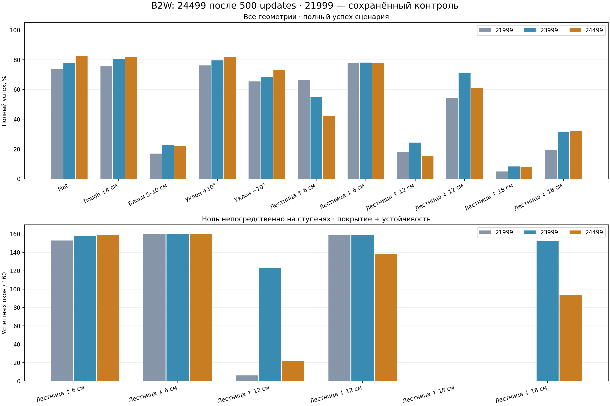

# 24499: проверка после 500 updates

27 сентября 2026. Финальный checkpoint локального продолжения 23999, seed 9704.
14 976 новых эпизодов: 234 сценария × 32 reset seeds × 2 policies. 23999/24499 проверены заново; 19999/21999/RL SAR — сохранённые контроли.

Полный успех 23999→24499: **4565→4616/7488**, unsafe **1→7**. К свежей 23999: улучшенных строк 41, ухудшенных 38, потерянных прежних 32/32 — 11.

Из **43 целевых строк** улучшились к свежей 23999 **23**; прежний full уровень 21999 без unsafe достигнут в **14**, прежние full+zero/exposure без unsafe — в **13**. Из 9 потерянных 32/32 полностью восстановлено **2**.

**Отсутствие регресса к 23999 не подтверждено.** Общая сумма не компенсирует отказы отдельных строк.

| Policy | Full / 7488 | Unsafe | Ноль на ступенях / 960 |
|---|---:|---:|---:|
|19999|3111|38|781|
|21999|4240|11|478|
|rl_sar|1610|74|366|
|23999|4565|1|752|
|24499|4616|7|573|

## Геометрии

| Геометрия | Full 21999 | Full 23999 | Full 24499 | Unsafe 23999→24499 |
|---|---:|---:|---:|---:|
|Flat|850/1152|896/1152|951/1152|0→0|
|Rough ±4 см|871/1152|928/1152|941/1152|0→0|
|Блоки 5–10 см|195/1152|264/1152|256/1152|1→3|
|Уклон +10°|877/1152|917/1152|944/1152|0→0|
|Уклон −10°|754/1152|788/1152|843/1152|0→0|
|Лестница ↑ 6 см|191/288|158/288|122/288|0→0|
|Лестница ↓ 6 см|224/288|225/288|224/288|0→0|
|Лестница ↑ 12 см|51/288|70/288|44/288|0→0|
|Лестница ↓ 12 см|157/288|204/288|176/288|0→0|
|Лестница ↑ 18 см|14/288|24/288|23/288|0→4|
|Лестница ↓ 18 см|56/288|91/288|92/288|0→0|

## Все 43 цели восстановления

Прежний уровень — сохранённая 21999 из теста, на котором составлен план обучения. «Полностью» означает достижение её full и zero/exposure counts без unsafe; это не новый статистический порог acceptance.

| Геометрия / сценарий | Прежняя 21999 | Свежая 23999 | 24499 | Unsafe | Полностью восстановлен |
|---|---:|---:|---:|---:|---|
|Flat / vx_+1.00|19/32|0/32|7/32|0|нет|
|Flat / vy_-1.00|31/32|30/32|32/32|0|да|
|Flat / wz_-1.00|31/32|30/32|31/32|0|да|
|Flat / diagonal_+1_+1|32/32|31/32|32/32|0|да|
|Rough ±4 см / vx_-1.00|27/32|14/32|23/32|0|нет|
|Rough ±4 см / vx_+1.00|6/32|0/32|3/32|0|нет|
|Rough ±4 см / vy_+0.30|2/32|0/32|18/32|0|да|
|Rough ±4 см / vy_+0.70|28/32|27/32|31/32|0|да|
|Rough ±4 см / vy_+1.00|21/32|15/32|28/32|0|да|
|Rough ±4 см / wz_-1.00|32/32|28/32|23/32|0|нет|
|Rough ±4 см / turning_-1_-1|32/32|31/32|31/32|0|нет|
|Rough ±4 см / diagonal_+1_+1|32/32|30/32|30/32|0|нет|
|Rough ±4 см / transitions_vy|7/32|0/32|15/32|0|да|
|Блоки 5–10 см / vx_-0.30|10/32|7/32|6/32|0|нет|
|Блоки 5–10 см / vx_+0.50|9/32|4/32|8/32|0|нет|
|Блоки 5–10 см / vx_-0.70|1/32|0/32|1/32|0|нет|
|Блоки 5–10 см / transitions_vx|5/32|2/32|1/32|0|нет|
|Уклон +10° / vx_+1.00|22/32|0/32|0/32|0|нет|
|Уклон +10° / vy_-0.70|32/32|29/32|29/32|0|нет|
|Уклон +10° / vy_-1.00|8/32|2/32|8/32|0|да|
|Уклон +10° / vy_+1.00|31/32|28/32|29/32|0|нет|
|Уклон +10° / wz_-1.00|31/32|30/32|29/32|0|нет|
|Уклон +10° / wz_+1.00|32/32|24/32|28/32|0|нет|
|Уклон +10° / diagonal_-1_-1|32/32|14/32|26/32|0|нет|
|Уклон −10° / vx_-1.00|2/32|0/32|0/32|0|нет|
|Уклон −10° / vy_-0.70|31/32|27/32|31/32|0|да|
|Уклон −10° / vy_-1.00|20/32|10/32|15/32|0|нет|
|Уклон −10° / vy_+1.00|5/32|4/32|17/32|0|да|
|Уклон −10° / wz_-0.70|32/32|31/32|32/32|0|да|
|Уклон −10° / wz_-1.00|29/32|27/32|24/32|0|нет|
|Уклон −10° / wz_+1.00|31/32|27/32|32/32|0|да|
|Уклон −10° / diagonal_-1_-1|30/32|2/32|1/32|0|нет|
|Уклон −10° / diagonal_+1_-1|31/32|28/32|29/32|0|нет|
|Уклон −10° / diagonal_+1_+1|28/32|22/32|28/32|0|да|
|Уклон −10° / turning_+1_+1|32/32|31/32|31/32|0|нет|
|Лестница ↑ 6 см / traverse_0.3|31/32|27/32|11/32|0|нет|
|Лестница ↑ 6 см / traverse_0.5|31/32|30/32|30/32|0|нет|
|Лестница ↑ 6 см / traverse_0.7|24/32|13/32|11/32|0|нет|
|Лестница ↑ 6 см / stair_stop_restart_0.3|30/32|12/32|2/32|0|нет|
|Лестница ↑ 6 см / stair_stop_reverse|31/32|19/32|8/32|0|нет|
|Лестница ↑ 12 см / traverse_0.7|22/32|13/32|8/32|0|нет|
|Лестница ↓ 12 см / stair_stop_restart_0.5|31/32|31/32|30/32|0|нет|
|Лестница ↑ 18 см / traverse_0.7|2/32|1/32|0/32|2|нет|

## Наибольшие новые регрессы к 23999

| Геометрия / сценарий | 23999→24499 | Δ |
|---|---:|---:|
|Лестница ↓ 12 см / backward_traverse|28→0|-28|
|Rough ±4 см / wz_-0.30|27→0|-27|
|Лестница ↑ 12 см / stair_stop_restart_0.5|22→4|-18|
|Rough ±4 см / wz_+0.30|26→10|-16|
|Лестница ↑ 6 см / traverse_0.3|27→11|-16|
|Лестница ↑ 6 см / stair_stop_reverse|19→8|-11|
|Лестница ↑ 12 см / traverse_0.5|30→19|-11|
|Лестница ↑ 6 см / stair_stop_restart_0.3|12→2|-10|
|Лестница ↓ 12 см / stair_stop_restart_0.3|32→25|-7|
|Блоки 5–10 см / vx_+0.30|25→19|-6|
|Rough ±4 см / wz_-1.00|28→23|-5|
|Лестница ↑ 12 см / traverse_0.7|13→8|-5|
|Rough ±4 см / diagonal_-1_-1|32→29|-3|
|Блоки 5–10 см / wz_-1.00|31→28|-3|
|Уклон −10° / wz_-1.00|27→24|-3|

## Ноль на ступенях

| Геометрия | 21999 / 160 | 23999 / 160 | 24499 / 160 |
|---|---:|---:|---:|
|Лестница ↑ 6 см|153|158|159|
|Лестница ↓ 6 см|160|160|160|
|Лестница ↑ 12 см|6|123|22|
|Лестница ↓ 12 см|159|159|138|
|Лестница ↑ 18 см|0|0|0|
|Лестница ↓ 18 см|0|152|94|

Непрерывный ноль Flat, 23999→24499: 1152→1152/1152.

## Safety и приводы

| Метрика | 23999 | 24499 |
|---|---:|---:|
|Unsafe|1|7|
|Минимальный hard joint margin, rad|-0.00188911|-0.0181514|
|Wheel speed peak, rad/s|63.3372|77.3319|
|Максимальная доля wheel torque saturation|0.662614|0.673523|
|Максимальная непрерывная wheel saturation, s|29.15|28.68|
|Пиковый наклон, °|36.7185|39.1777|

Причины unsafe 24499: `{"hard_joint_position": 7}`. Все 16 приводов сохранены в [actuators.csv](evidence/fullcycle_24499_20260927/actuators.csv). Applied torque — оценка implicit PD; токи, нагрев и аппаратные torque-speed limits не проверялись.

## Повторный контроль 23999

| Геометрия | Full сохранённый→свежий | Изменились outcomes / flags |
|---|---:|---:|
|Flat|896→896|0 / 0|
|Rough ±4 см|928→928|0 / 0|
|Блоки 5–10 см|266→264|101 / 124|
|Уклон +10°|917→917|0 / 0|
|Уклон −10°|788→788|0 / 0|
|Лестница ↑ 6 см|173→158|65 / 75|
|Лестница ↓ 6 см|225→225|0 / 3|
|Лестница ↑ 12 см|62→70|57 / 134|
|Лестница ↓ 12 см|216→204|24 / 32|
|Лестница ↑ 18 см|28→24|19 / 57|
|Лестница ↓ 18 см|90→91|21 / 28|

Позиция 23999 в парном terrain batch сменилась со второй половины на первую. Причины возможных расхождений не изолированы; основной контроль — свежая 23999.

## Проверки и ограничения

Повторно рассчитаны 14976 outcomes/flags/segments. Лестничное exposure восстановлено из root/wheel positions и contact forces. Safety берётся из исходной telemetry 200 Hz; joint traces 10 Hz не позволяют независимо повторить каждую physics-step safety проверку.

Проверены hashes, ABI 57→16, экспорт на 295 inputs с max abs 0.0, точный resume весов/Adam, ровно 500 updates и сохранность physics/rewards. Это повторный development screen после обучения на известных регрессах; независимая qualification, MuJoCo sim2sim и hardware approval отсутствуют. 32/32 reset seeds не доказывает 99% надёжность и не оценивает training-seed variance.

- [Объявленный протокол](../experiments/24499_full_validation_20260927.md).
- [Все 234 сценария и пять policies](evidence/fullcycle_24499_20260927/rows.csv).
- [Summary, restoration и hashes](evidence/fullcycle_24499_20260927/summary.json).

Raw JSON/NPZ: `logs/fullcycle24499_validation_20260927/`; предыдущие evidence сохранены.
