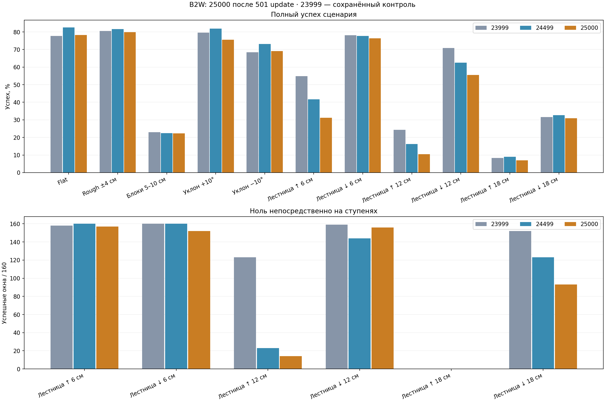

# 25000: проверка после 501 update

27 сентября 2026. 14 976 новых эпизодов: 234 сценария × 32 reset seeds × 2 policies. 24499/25000 проверены заново; 19999/21999/23999/RL SAR — сохранённые контроли.

Полный успех 24499→25000: **4629→4353/7488**, unsafe **7→3**. Улучшенных строк 28, ухудшенных 61, потерянных прежних 32/32 — 15.

Из 92 целевых строк улучшились 21; лучшие прежние full counts 21999/23999 без unsafe достигнуты в 44, full+zero/exposure — в 18. Возвращены 7 из 18 потерянных 32/32.

**Отсутствие регресса к 24499 не подтверждено.**

| Policy | Full / 7488 | Unsafe | Ноль на ступенях / 960 |
|---|---:|---:|---:|
|19999|3111|38|781|
|21999|4240|11|478|
|23999|4565|1|752|
|rl_sar|1610|74|366|
|24499|4629|7|610|
|25000|4353|3|572|

## Все геометрии

| Геометрия | Full 23999 | Full 24499 | Full 25000 | Unsafe 24499→25000 |
|---|---:|---:|---:|---:|
|Flat|896/1152|951/1152|901/1152|0→0|
|Rough ±4 см|928/1152|941/1152|920/1152|0→0|
|Блоки 5–10 см|264/1152|259/1152|257/1152|2→2|
|Уклон +10°|917/1152|944/1152|870/1152|0→0|
|Уклон −10°|788/1152|843/1152|796/1152|0→0|
|Лестница ↑ 6 см|158/288|120/288|90/288|0→0|
|Лестница ↓ 6 см|225/288|224/288|220/288|0→0|
|Лестница ↑ 12 см|70/288|47/288|30/288|0→0|
|Лестница ↓ 12 см|204/288|180/288|160/288|0→0|
|Лестница ↑ 18 см|24/288|26/288|20/288|5→1|
|Лестница ↓ 18 см|91/288|94/288|89/288|0→0|

## Ноль на ступенях

| Геометрия | 23999 / 160 | 24499 / 160 | 25000 / 160 |
|---|---:|---:|---:|
|Лестница ↑ 6 см|158|160|157|
|Лестница ↓ 6 см|160|160|152|
|Лестница ↑ 12 см|123|23|14|
|Лестница ↓ 12 см|159|144|156|
|Лестница ↑ 18 см|0|0|0|
|Лестница ↓ 18 см|152|123|93|

## Все 92 цели

База — максимум каждого показателя у сохранённых 21999/23999. Восстановление требует full, continuous-zero и stair-exposure не ниже базы и ноль unsafe. Это известные training targets.

| Геометрия / сценарий | База full | Свежая 24499 | 25000 | Unsafe | Восстановлен full+zero |
|---|---:|---:|---:|---:|---|
|Flat / vx_+1.00|19|7|2|0|нет|
|Flat / diagonal_-1_-1|32|31|32|0|да|
|Rough ±4 см / vx_+0.70|32|31|32|0|да|
|Rough ±4 см / vx_-1.00|27|23|12|0|нет|
|Rough ±4 см / vx_+1.00|6|3|2|0|нет|
|Rough ±4 см / vy_-0.50|31|29|31|0|да|
|Rough ±4 см / vy_-0.70|30|30|23|0|нет|
|Rough ±4 см / wz_-0.30|27|0|0|0|нет|
|Rough ±4 см / wz_+0.30|26|10|32|0|да|
|Rough ±4 см / wz_-0.70|32|31|32|0|да|
|Rough ±4 см / wz_-1.00|32|23|24|0|нет|
|Rough ±4 см / diagonal_-1_-1|32|29|28|0|нет|
|Rough ±4 см / turning_-1_-1|32|31|30|0|нет|
|Rough ±4 см / diagonal_+1_-1|24|24|29|0|да|
|Rough ±4 см / diagonal_+1_+1|32|30|31|0|нет|
|Rough ±4 см / transitions_wz|19|17|28|0|да|
|Блоки 5–10 см / vx_-0.30|10|5|9|0|нет|
|Блоки 5–10 см / vx_+0.30|25|19|15|0|нет|
|Блоки 5–10 см / vx_-0.50|0|1|0|0|нет|
|Блоки 5–10 см / vx_+0.50|9|8|2|0|нет|
|Блоки 5–10 см / vx_-0.70|1|0|0|0|нет|
|Блоки 5–10 см / vx_+0.70|5|1|4|0|нет|
|Блоки 5–10 см / vx_-1.00|0|0|0|0|нет|
|Блоки 5–10 см / vy_+0.30|0|0|0|0|нет|
|Блоки 5–10 см / vy_-0.50|0|0|0|0|нет|
|Блоки 5–10 см / vy_+0.50|0|0|0|0|нет|
|Блоки 5–10 см / vy_-0.70|0|0|0|0|нет|
|Блоки 5–10 см / vy_+0.70|0|0|0|0|нет|
|Блоки 5–10 см / vy_-1.00|0|0|0|1|нет|
|Блоки 5–10 см / vy_+1.00|0|0|0|0|да|
|Блоки 5–10 см / wz_-0.50|32|31|32|0|да|
|Блоки 5–10 см / wz_+0.50|32|31|32|0|да|
|Блоки 5–10 см / wz_-1.00|31|30|31|0|да|
|Блоки 5–10 см / wz_+1.00|30|32|32|0|да|
|Блоки 5–10 см / diagonal_-1_-1|0|0|0|0|нет|
|Блоки 5–10 см / diagonal_-1_+1|0|0|0|0|нет|
|Блоки 5–10 см / turning_-1_+1|2|2|1|0|нет|
|Блоки 5–10 см / transitions_vx|5|3|3|0|нет|
|Блоки 5–10 см / transitions_vy|0|0|0|0|да|
|Уклон +10° / vx_-1.00|32|31|30|0|нет|
|Уклон +10° / vx_+1.00|22|0|0|0|нет|
|Уклон +10° / vy_-0.50|32|31|31|0|нет|
|Уклон +10° / vy_-0.70|32|29|25|0|нет|
|Уклон +10° / vy_+1.00|31|29|25|0|нет|
|Уклон +10° / wz_+0.30|0|0|0|0|да|
|Уклон +10° / wz_-1.00|31|29|30|0|нет|
|Уклон +10° / wz_+1.00|32|28|23|0|нет|
|Уклон +10° / diagonal_-1_-1|32|26|21|0|нет|
|Уклон +10° / turning_+1_-1|32|30|32|0|да|
|Уклон −10° / vx_-1.00|2|0|0|0|нет|
|Уклон −10° / vy_+0.50|32|31|31|0|нет|
|Уклон −10° / vy_-1.00|20|15|17|0|нет|
|Уклон −10° / wz_-1.00|29|24|30|0|нет|
|Уклон −10° / diagonal_-1_-1|30|1|0|0|нет|
|Уклон −10° / diagonal_+1_-1|31|29|29|0|нет|
|Уклон −10° / diagonal_+1_+1|28|28|22|0|нет|
|Уклон −10° / turning_+1_+1|32|31|29|0|нет|
|Лестница ↑ 6 см / traverse_0.3|31|9|0|0|нет|
|Лестница ↑ 6 см / traverse_0.5|31|30|26|0|нет|
|Лестница ↑ 6 см / traverse_0.7|24|14|11|0|нет|
|Лестница ↑ 6 см / stair_stop_restart_0.3|30|2|0|0|нет|
|Лестница ↑ 6 см / stair_stop_restart_0.5|30|30|21|0|нет|
|Лестница ↑ 6 см / stair_stop_reverse|31|7|3|0|нет|
|Лестница ↑ 6 см / stair_stop_yaw_-1|1|0|0|0|нет|
|Лестница ↓ 6 см / stair_stop_yaw_-1|0|0|0|0|нет|
|Лестница ↓ 6 см / stair_stop_yaw_+1|1|0|0|0|нет|
|Лестница ↑ 12 см / traverse_0.3|0|0|0|0|нет|
|Лестница ↑ 12 см / traverse_0.5|30|20|17|0|нет|
|Лестница ↑ 12 см / traverse_0.7|22|7|9|0|нет|
|Лестница ↑ 12 см / stair_stop_restart_0.3|0|0|0|0|нет|
|Лестница ↑ 12 см / stair_stop_restart_0.5|22|8|4|0|нет|
|Лестница ↑ 12 см / stair_stop_reverse|0|0|0|0|нет|
|Лестница ↑ 12 см / stair_stop_yaw_-1|0|0|0|0|нет|
|Лестница ↑ 12 см / stair_stop_yaw_+1|0|0|0|0|нет|
|Лестница ↓ 12 см / backward_traverse|28|0|0|0|нет|
|Лестница ↓ 12 см / stair_stop_restart_0.3|32|27|32|0|да|
|Лестница ↓ 12 см / stair_stop_restart_0.5|31|31|28|0|нет|
|Лестница ↓ 12 см / stair_stop_reverse|17|26|4|0|нет|
|Лестница ↓ 12 см / stair_stop_yaw_-1|0|0|0|0|да|
|Лестница ↓ 12 см / stair_stop_yaw_+1|0|0|0|0|нет|
|Лестница ↑ 18 см / traverse_0.3|0|0|0|0|нет|
|Лестница ↑ 18 см / traverse_0.7|2|1|2|1|нет|
|Лестница ↑ 18 см / stair_stop_restart_0.3|0|0|0|0|нет|
|Лестница ↑ 18 см / stair_stop_restart_0.5|0|0|0|0|да|
|Лестница ↑ 18 см / stair_stop_reverse|0|0|0|0|нет|
|Лестница ↑ 18 см / stair_stop_yaw_-1|0|0|0|0|нет|
|Лестница ↑ 18 см / stair_stop_yaw_+1|0|0|0|0|нет|
|Лестница ↓ 18 см / stair_stop_restart_0.3|0|2|0|0|нет|
|Лестница ↓ 18 см / stair_stop_restart_0.5|28|27|25|0|нет|
|Лестница ↓ 18 см / stair_stop_reverse|0|0|0|0|нет|
|Лестница ↓ 18 см / stair_stop_yaw_-1|0|0|0|0|нет|
|Лестница ↓ 18 см / stair_stop_yaw_+1|0|0|0|0|нет|

## Новые регрессы

| Геометрия / сценарий | Full 24499→25000 |
|---|---:|
|Уклон +10° / vx_+0.30|32→2|
|Flat / vy_+0.30|25→0|
|Уклон −10° / diagonal_-1_+1|30→7|
|Лестница ↓ 12 см / stair_stop_reverse|26→4|
|Flat / transitions_vy|25→5|
|Rough ±4 см / vy_+0.30|18→3|
|Rough ±4 см / transitions_vy|15→1|
|Rough ±4 см / vy_-1.00|27→15|
|Лестница ↑ 12 см / backward_traverse|12→0|
|Rough ±4 см / vx_-1.00|23→12|
|Уклон +10° / diagonal_+1_+1|31→21|
|Уклон −10° / vy_+1.00|17→7|
|Лестница ↑ 6 см / traverse_0.3|9→0|
|Лестница ↑ 6 см / stair_stop_restart_0.5|30→21|
|Уклон +10° / vy_-1.00|8→0|
|Rough ±4 см / vy_-0.70|30→23|
|Лестница ↑ 18 см / traverse_0.5|25→18|
|Блоки 5–10 см / vx_+0.50|8→2|
|Уклон −10° / diagonal_+1_+1|28→22|
|Flat / vx_+1.00|7→2|
|Уклон +10° / wz_+1.00|28→23|
|Уклон +10° / diagonal_-1_-1|26→21|
|Блоки 5–10 см / vx_+0.30|19→15|
|Уклон +10° / vy_-0.70|29→25|
|Уклон +10° / vy_+1.00|29→25|
|Уклон −10° / vy_+0.70|31→27|
|Уклон −10° / wz_+1.00|32→28|
|Лестница ↑ 6 см / traverse_0.5|30→26|
|Лестница ↑ 6 см / stair_stop_reverse|7→3|
|Лестница ↑ 12 см / stair_stop_restart_0.5|8→4|
|Уклон +10° / vy_-0.30|3→0|
|Уклон +10° / diagonal_-1_+1|32→29|
|Уклон −10° / vy_-0.70|31→28|
|Лестница ↑ 6 см / traverse_0.7|14→11|
|Лестница ↑ 12 см / traverse_0.5|20→17|
|Лестница ↓ 12 см / stair_stop_restart_0.5|31→28|
|Rough ±4 см / vy_+1.00|28→26|
|Rough ±4 см / diagonal_-1_+1|32→30|
|Уклон +10° / diagonal_+1_-1|32→30|
|Уклон −10° / turning_-1_-1|32→30|
|Уклон −10° / turning_+1_+1|31→29|
|Лестница ↑ 6 см / stair_stop_restart_0.3|2→0|
|Лестница ↓ 6 см / stair_stop_restart_0.3|32→30|
|Лестница ↓ 6 см / stair_stop_reverse|32→30|
|Лестница ↓ 18 см / traverse_0.3|2→0|
|Лестница ↓ 18 см / stair_stop_restart_0.3|2→0|
|Лестница ↓ 18 см / stair_stop_restart_0.5|27→25|
|Flat / vy_+0.50|32→31|
|Flat / vy_-1.00|32→31|
|Rough ±4 см / vx_+1.00|3→2|
|Rough ±4 см / diagonal_-1_-1|29→28|
|Rough ±4 см / turning_-1_-1|31→30|
|Rough ±4 см / turning_+1_+1|32→31|
|Блоки 5–10 см / vx_-0.50|1→0|
|Блоки 5–10 см / wz_+0.70|32→31|
|Блоки 5–10 см / turning_-1_+1|2→1|
|Уклон +10° / vx_-1.00|31→30|
|Уклон +10° / vy_+0.50|32→31|
|Уклон +10° / vy_+0.70|32→31|
|Уклон +10° / wz_-0.70|32→31|
|Уклон −10° / diagonal_-1_-1|1→0|

## Safety и повторный контроль

Причины unsafe 25000: `{"hard_joint_position": 3}`.

Hard joint margin: -0.00939173→-0.0127726 rad; wheel speed peak: 70.1→67.83 rad/s.

| Геометрия | Full 24499 сохранённый→свежий | Изменились outcomes / flags |
|---|---:|---:|
|Flat|951→951|0 / 0|
|Rough ±4 см|941→941|0 / 0|
|Блоки 5–10 см|256→259|103 / 124|
|Уклон +10°|944→944|0 / 0|
|Уклон −10°|843→843|0 / 0|
|Лестница ↑ 6 см|122→120|54 / 80|
|Лестница ↓ 6 см|224→224|0 / 7|
|Лестница ↑ 12 см|44→47|62 / 122|
|Лестница ↓ 12 см|176→180|27 / 43|
|Лестница ↑ 18 см|23→26|18 / 119|
|Лестница ↓ 18 см|92→94|19 / 74|

24499 перешла из второй половины terrain batch в первую; причины расхождений не изолированы. Основной контроль — свежая 24499. Старые evidence сохранены.

## Проверки и ограничения

Все 14 976 outcomes/flags/segments и физическое stair exposure перепроверены по traces. Safety берётся из исходной telemetry 200 Hz; joint traces 10 Hz не являются независимым повтором каждого physics step. Экспорт проверен на 295 inputs, max abs 0.0. ABI, hashes, model/Adam resume, 501 update и объявленные изменения config проверены. Это development screen, не независимая qualification. 32/32 не доказывает 99% надёжность. Applied torque — оценка implicit PD; аппаратные limits, токи, нагрев, MuJoCo и hardware approval не проверены.

- [Протокол](../experiments/25000_full_validation_20260927.md).
- [Summary и hashes](evidence/fullcycle_25000_20260927/summary.json).
- [Все строки](evidence/fullcycle_25000_20260927/rows.csv).
- [Все 16 приводов](evidence/fullcycle_25000_20260927/actuators.csv).

Raw: `logs/fullcycle25000_validation_20260927/`.
